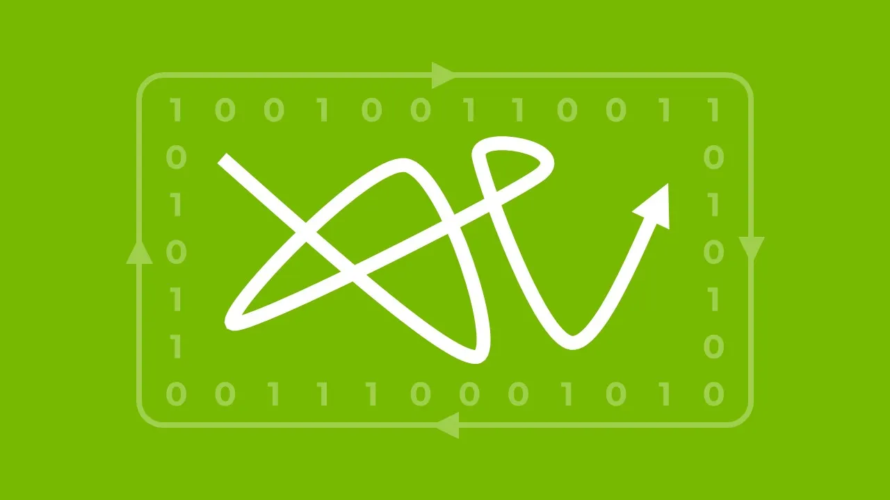
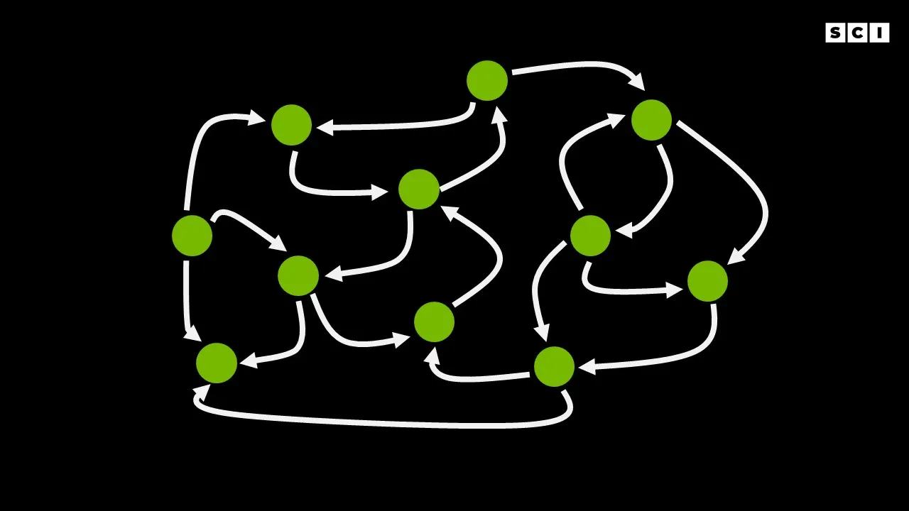
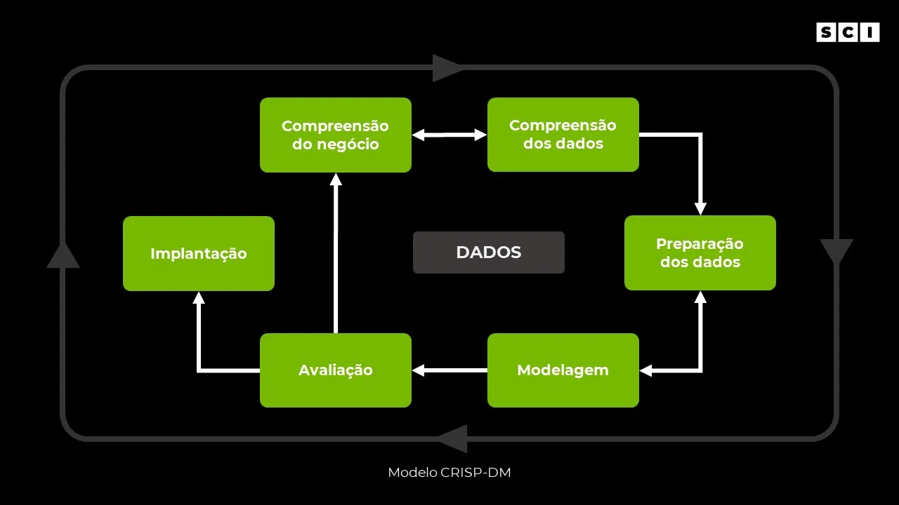
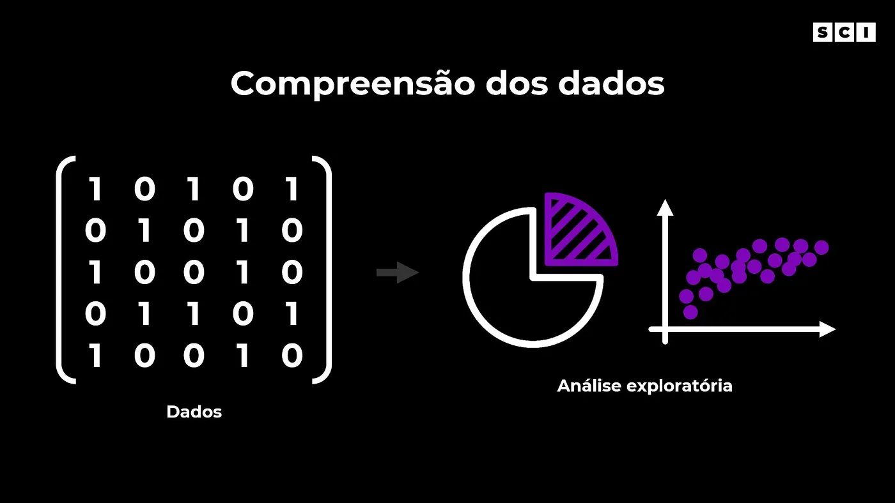
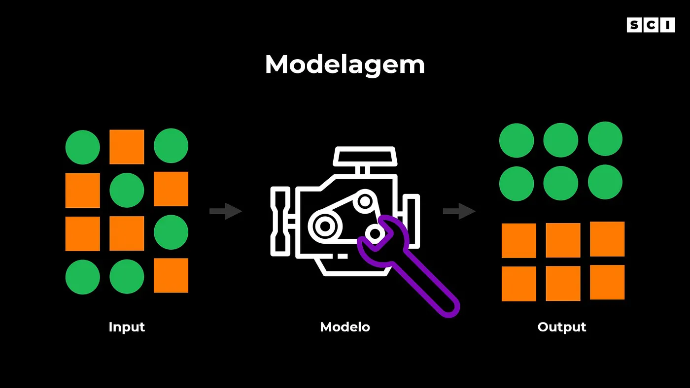


  Este artigo foi originalmente publicado em 2021 no [Medium](https://medium.com/importsci/o-processo-do-data-science-d13837b15240).


Hoje vamos falar sobre o processo do Data Science, desde a necessidade de negócio até a implementação e acompanhamento dos modelos. O objetivo deste post é conhecermos mais sobre o ciclo dos projetos de data science e cada uma de suas etapas.

## Introdução

Antes de falarmos sobre esse processo, precisamos ter em mente o objetivo geral do Data Science: gerar valor para o negócio. Esse fator é muito importante e muitas vezes é esquecido ou deixado de lado durante os projetos. As vezes o foco fica em uma solução perfeita que temos em mente, mas essa é a melhor solução para o negócio? Ela realmente gera valor? Os recursos gastos compensam?

Essas são perguntas que precisamos ficar atentos quando estamos falando em aplicar soluções de dados em problemas reais. Não adianta termos a solução perfeita em nosso computador se ela não funciona na prática (em produção, generalizando para novos dados) ou se o modelo criado não atende as necessidades do negócio.

Esses são fatores essenciais no processo de Data Science e por isso existem frameworks que ajudam a estruturar esse processo. Entretanto, assim como falamos anteriormente, a área de Data Science utiliza aspectos do método científico aplicados e portanto, esse processo não é linear. Não há etapas que são cumpridas em uma ordem linear, uma após a outra até o fim, mas sim, um processo iterativo, onde há um “vai e vem” nas etapas.

Isso é extremamente importante, principalmente quando estamos falando em um cenário real, onde outras áreas de uma empresa estão envolvidas e existem prazos para o cumprimento das demandas.

Desta forma, neste post vamos utilizar o CRISP-DM, um framework que faz a disposição das principais atividades do processo de Data Science e a relação entre elas.

## O modelo CRISP-DM

O modelo CRISP-DM (Cross-industry standard process for data mining) surgiu e evoluiu nos anos 2000 e descreve o processo do Data Science. Desta forma, ele é composto das 6 principais etapas:

- Compreensão do negócio
- Compreensão dos dados
- Preparação dos dados
- Modelagem
- Avaliação
- Implantação

Como falamos, esse processo não é linear, sendo muito comum e saudável as “idas e vindas” dessas etapas. A imagem a seguir apresenta esse modelo, e as setas indicam a relação e os caminhos mais comuns nesse processo.

Além disso, é importante ressaltar essa natureza cíclica do modelo. A ideia é que esse processo seja contínuo mesmo após a implantação. Dessa forma, os aprendizados de um ciclo, geram um maior entendimento do negócio e direcionam esforços, melhorando os ciclos futuros.

> O objetivo deste post é termos uma visão geral de cada uma dessas etapas.

### Compreensão do negócio

Essa talvez seja a parte mais importante do processo. É essencial compreender o problema que será abordado. Isso pode parecer óbvio, mas grande parte dos projetos não tem um problema bem definido e estruturado. Portanto, o cientista de dados deve explorar o escopo do problema e levantar as perguntas ou problemas de negócio que poderão ser respondidas ou resolvidas com dados.

Esse processo interage com a segunda etapa em um ciclo que pode ter várias repetições e envolver diferentes equipes dependendo do escopo do projeto. O objetivo desta primeira etapa é termos claro a necessidade de negócio e os casos de uso (como esse trabalho de dados será usado no futuro). Desta forma, é interessante usarmos um bom tempo nessas primeiras etapas, já que o escopo do projeto e suas necessidades alteram completamente as soluções de dados.

### Compreensão dos dados
O objetivo desta etapa é entender os dados. Entretanto, antes disso precisamos obviamente ter os dados. Desta forma, mapeamos quais os dados que são relevantes para resolvermos um problema de negócio. Se não temos os dados necessários, precisamos pensar em uma maneira de obtê-los e dependendo da complexidade isso já abre um caminho para um novo projeto.

Considerando que temos os dados necessários, fazendo uma análise exploratória. A ideia aqui é entendermos melhor os dados do problema que estamos trabalhando e para isso usamos várias técnicas de Data Visualization (falaremos sobre isso em outros posts). Basicamente, cruzamos algumas variáveis e entendemos o comportamento delas.

Vamos dar um exemplo para ficar mais tangível: trabalhamos em um banco e para conceder um empréstimo aos clientes fazemos uma análise do seu perfil. Queremos entender quais pessoas são os melhores pagadores e quais não. Para isso, podemos cruzar algumas variáveis desses clientes, como a idade ou salário com a variável de atraso de pagamentos.

Desta forma, começamos a entender melhor os dados e podemos criar algumas hipóteses, que nos ajudarão tanto na comunicação da solução com a área de negócio, quanto na etapa de modelagem.

Essa etapa é extremamente importante e como você já deve ter notado, os aprendizados obtidos ajudam no entendimento do problema e direcionam o escopo do projeto.

### Preparação dos dados
Na área de Data Science a quantidade de dados é importante, mas a qualidade é ainda mais. Os modelos que utilizamos ou análises que fazemos dependem da qualidade dos dados e do formato ou tipo de dados. Portanto, nessa etapa é onde preparamos os dados, fazemos uma limpeza e deixamos no formato necessário para criarmos os modelos.

Essa etapa geralmente toma grande parte do tempo do projeto e é utilizada para converter o tipo dos dados, extrair ou limpar os dados de uma base, converter dados para o formato tabular e até definir regras quando temos dados faltantes.

Não se preocupe agora com esses termos que acabamos de falar. O que você precisa entender é: nesta etapa vamos preparar os dados para conseguirmos fazer análises e criar modelos. Talvez você esteja se perguntando: esta etapa de preparação não deveria vir antes da compreensão? E realmente muitas vezes ela vem antes, sendo necessária para conseguirmos compreender os dados.

### Modelagem
Agora que já temos um problema bem definido, já entendemos nossos dados, já limpamos e preparamos nossa base, vamos criar um modelo. Legal! Mas o que é um modelo?

O modelo é o famoso algoritmo, que você já deve ter ouvido falar. Ele é o responsável por determinar qual a ordem que os posts vão aparecer no seu Facebook, qual filme o Netflix vai te recomendar e qual será o próximo vídeo que será sugerido para você no Youtube. Basicamente ele é o motor por trás das decisões, ele reconhece padrões nos dados e cumpre uma determinada tarefa. Dessa forma, o processo de criar o modelo é chamado de modelagem.

Essa é a etapa em que geralmente há maior empolgação, onde utilizamos os algoritmos tradicionais de estatística ou os de Machine Learning para ensinar o computador a realizar uma tarefa ou extrair informações úteis para solucionarmos nosso problema de negócio.

Aqui há um ponto extremamente importante. O tipo do modelo que vamos criar depende de uma série de fatores (que vão além do escopo deste post). De forma geral, o principal é a necessidade de negócio. Às vezes precisamos criar um modelo que funcione em produção e às vezes não.

Vou explicar: imagine você utilizando o Netflix em uma sexta à noite. No momento que você entra na sua conta, esse tal de modelo (algoritmo) utiliza toda sua inteligência para falar quais filmes ou séries são relevantes para você. Isso é um modelo em produção, ou seja, ele foi criado e está sendo usado efetivamente na operação da empresa em tempo real, com base nos dados fornecidos e sendo atualizado frequentemente.

Entretanto, nem todos os modelos são assim e nem precisam ser. Esse é o ponto importante que falei. Alguns modelos são usados em produção (como o do exemplo anterior) e outros são usados para a tomada de decisão de negócio.

Por exemplo: ainda pensando na Netflix, mas agora somos cientistas de dados que trabalham na empresa. A Netflix tem um catálogo gigante de filmes e milhões de clientes, ou seja, é humanamente impossível nós como cientistas de dados da empresa conversarmos com todos os clientes sobre o que eles acharam de cada filme que assistiram. Portanto, utilizamos os dados para entender isso, verificando os filmes que eles assistiram, se eles gostaram e se estão continuando com a assinatura. Dessa forma, podemos entender o tipo de conteúdo que os clientes gostam e ajudar a direcionar a verba de produção de conteúdo para novos filmes e séries.

Então nesta etapa de modelagem criamos um ou mais modelos. Para isso nós precisamos treinar esse modelo. Pense no modelo como uma criança. Ela não conhece o mundo e precisa que você ensine as coisas. No início ela não sabe diferenciar um gato de um cachorro, mas com um pouco de ajuda e alguns exemplos ela faz isso em menos de um segundo. Tudo isso através do reconhecimento de padrões. Desta forma, treinamos esse modelo para fazer algo que queremos, ou seja, ajudar na solução do nosso problema.

Essa etapa de modelagem é bem mais complexa do que eu apresentei acima, mas o objetivo aqui é ter essa visão geral. Em breve vamos criar outros posts mais específicos sobre os modelos, seus tipos, quando usar cada um e como eles funcionam. O importante neste momento é ter esses conceitos bem claros em sua mente: os modelos precisam dos dados para reconhecer padrões e “aprender”.

### Avaliação
Após a criação do modelo precisamos avaliar se ele realmente está funcionando como planejamos. Voltando ao exemplo da criança: após mostrarmos alguns exemplos de gatos e cachorros através de fotos e falarmos qual é qual, mostramos fotos novas que não demos a resposta anteriormente. Assim conseguimos ver se a criança realmente aprendeu a diferenciar um gato de um cachorro, ou se ela apenas decorou as respostas.

Um outro exemplo é uma prova de matemática. Um professor está ensinando adição e subtração. Durante as aulas ele mostra alguns exemplos, como ``4 + 4 = 8`` ou ``8 + 7 = 15``. Entretanto, na prova ele avalia os alunos com outros exemplos, como ``7 + 4 = ?``

Da mesma forma, ele consegue ver se o aluno realmente aprendeu ou se apenas decorou os exemplos usados em aula.

Um modelo funciona da mesma forma. Precisamos entender se o modelo que criamos realmente aprendeu, ou seja, conseguiu reconhecer padrões e consegue aplicar em novos exemplos.

Desta forma, essa etapa de avaliação é extremamente importante para entendermos se o modelo está bom o suficiente para implementarmos na prática. Geralmente utilizamos algumas medidas que monitoram o desempenho do modelo (que falaremos com detalhe em outro post), comparando com outros modelos e com decisões aleatórias.

O que precisa ficar claro é: a maneira de avaliar um modelo depende da aplicação no negócio, seu impacto e no tipo de modelo específico que foi criado. Sendo assim, em alguns casos essa etapa de avaliação pode demorar mais ou menos para seguir para a implementação.

### Implantação

Nesta etapa os resultados do projeto são colocados em prática. Como já falamos existem 2 maneiras: (1) através da implantação do modelo em produção ou (2) através do conhecimento gerado, que é usado na tomada de decisão de negócios.

Lembre-se, um modelo em produção é um modelo que vai estar implementado na operação da empresa, capturando os dados e gerando respostas. Mas o mais importante é que um modelo em produção vai aprendendo com os novos dados e pode se adaptar a mudanças. Isso é importante porque os negócios estão em constante transformação e ajuda a equipe de cientistas de dados a focar em outros projetos, além de gerar escala para o negócio.

Uma coisa que é importante ressaltar é que esses modelos de inteligência artificial ou Machine Learning têm limitações de acordo com o escopo que foi criado. Ou seja, dependendo das mudanças do mercado e das necessidades de negócio, os modelos precisam ser atualizados e até substituídos. Desta forma, após a implantação há um acompanhamento do modelo, avaliando algumas métricas constantemente (inclusive algumas que foram usadas na etapa de avaliação).

## Para conhecer mais
Se você curtiu o conteúdo e quer ver um case real de como o Spotify utiliza dados para personalizar as experiências dá uma olhada nesses conteúdos:

 



  


Nos próximos posts vamos entrar nessas etapas do processo com maior profundidade, abordando conceitos técnicos e de negócios.

Nos vemos em breve!