
  Este artigo foi originalmente publicado em 2022 no [Medium](https://medium.com/importsci/qual-a-diferen%C3%A7a-entre-intelig%C3%AAncia-artificial-machine-learning-data-science-e-deep-learning-2e5f92e39e16).


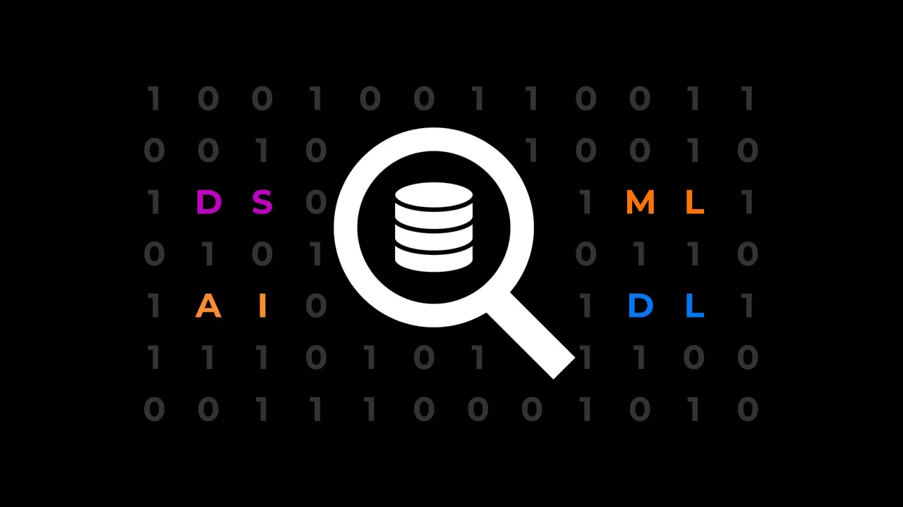

Hoje vamos falar sobre os principais conceitos da área de dados: Inteligência Artificial, Machine Learning, Data Science e Deep Learning. O objetivo deste post é apresentar cada um desses conceitos, suas diferenças e exemplos práticos. Além disso, mostraremos a relação entre estes conceitos e como eles estão contidos na área de dados.

## Rápido crescimento da área de dados
Nas últimas décadas vivenciamos um crescimento exponencial na quantidade de dados gerados e no poder computacional disponível para processá-los. Aliado a essas evoluções, aplicações práticas que geram valor a partir destes dados para empresas, governos e sociedade com resultados tangíveis, fizeram com que o interesse na área de dados crescesse de forma impressionante.

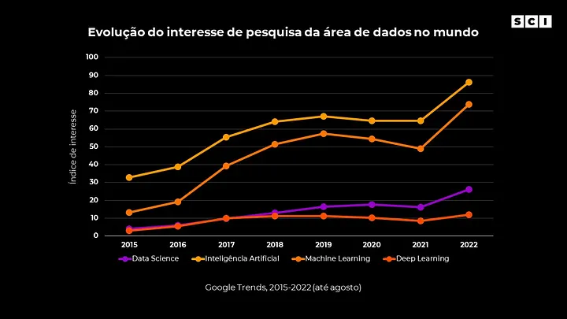

Se por um lado avançamos nas pesquisas, gerando conhecimento sobre novas técnicas e modelos (como transformers e LSTM), por outro o hype sobre o assunto cresceu na mídia e consequentemente para a população em geral.

Num assunto tão interessante como esse (muitas vezes tratado em filmes e obras de ficção científica) é natural o grande interesse e curiosidade da população. Entretanto, a rápida popularização de conceitos como Inteligência Artificial e Machine Learning, faz com que muitas vezes esses termos sejam usados de forma “equivocada” pela mídia não especializada, causando uma confusão no real significado de cada um deles para o público em geral.

## Entendendo cada conceito
Data science, Inteligência Artificial, Machine Learning e Deep Learning são os principais conceitos da área de dados. A seguir apresentamos a definição de cada um e a relação entre si através do diagrama de Venn (uma forma para representar graficamente um conjunto).

Basicamente o diagrama de Venn coloca os conceitos (conjuntos que têm algo em comum) em “caixinhas” e apresenta a relação entre elas. Uma caixinha pode estar dentro de outra ou compartilhar apenas uma parte do seu conteúdo, mostrando a relação de pertencimento ou interseção entre conceitos.

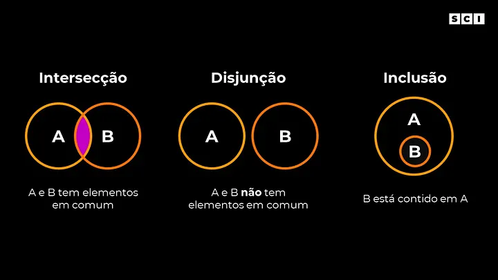

Alguns exemplos:

- Bananas são frutas e são amarelas. Ou seja, bananas pertencem ao grupo de coisas amarelas e também pertencem ao grupo de frutas. Entretanto, nem todas as coisas amarelas são frutas, apenas uma parte (chamado de intersecção).
- Todas as cobras são animais. Ou seja, o conjunto das cobras pertence (está contido) ao conjunto dos animais.
- Animais e frutas são coisas diferentes, ou seja, nenhum animal é uma fruta e vice-versa (nenhum item pertence simultaneamente nesses grupos).

### Data Science
Data science (em português, ciência de dados) é a área de dados como um todo, envolvendo desde o entendimento de negócios, coleta dos dados, pré-processamento, análise exploratória, até o desenvolvimento de algoritmos e sua implantação com objetivo de gerar valor para um negócio. Para isso, a área de data science é a intersecção de 3 grandes áreas: ciência da computação, matemática e negócios.

> Entenda negócios como a área específica de aplicação que é necessário ter o domínio. Alguns exemplos: em uma aplicação na área de saúde pode ser necessário ter conhecimento sobre medicina ou saúde pública para evoluir com as análises corretas. Já em uma aplicação para gestão de investimentos é necessário conhecimentos de finanças, contabilidade e economia.

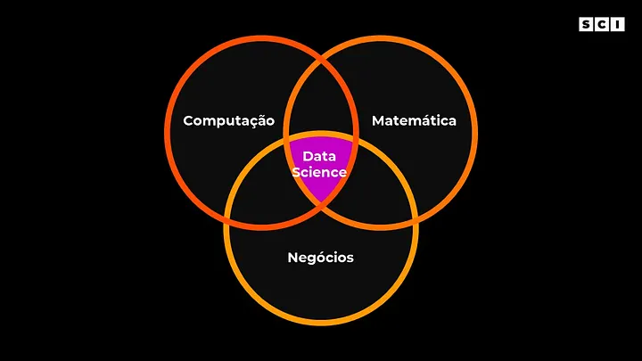

e modo geral, a área de data science aplica o método científico com objetivo de gerar valor para um negócio (área específica de atuação), seja um produto totalmente novo (Google Tradutor), uma nova funcionalidade em um produto existente (rádio da música no Spotify) ou até uma melhor compreensão do comportamento dos consumidores do seu mercado para que você tome decisões mais assertivas (decisões de novos conteúdos na Netflix).

Veja aplicações práticas de data science na Netflix:





Desta forma, vamos representar o conceito data science em nosso diagrama de Venn, como um conjunto mais amplo.

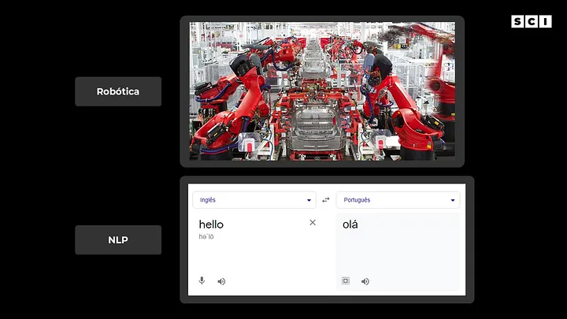

### Inteligência Artificial (IA)
Inteligência artificial é a área de estudo que tem como objetivo não só entender como seres inteligentes percebem, compreendem, preveem e manipulam o mundo ao seu redor, mas também criar entidades inteligentes capaz de realizar essas tarefas (Stuart Russell e Peter Norvig, Artificial Intelligence: A Modern Approach).

Este é um campo na ciência relativamente novo, iniciado após a Segunda Guerra Mundial, principalmente pelos esforços do inglês Alan Turing e sua proposta em 1950 de uma forma de prover uma definição operacional satisfatória sobre o que é inteligência, o famoso Turing Test.

Basicamente sistemas de IA são computadores ou um robô (controlados por um computador) que realizam tarefas comumente associadas a seres inteligentes, como habilidade de se comunicar em inglês, português e etc (natural language processing), identificar e reconhecer objetos (computer vision), tomada de decisão autônoma (a partir do que se sabe), manipular objetos (através da robótica) e se adaptar a novas circunstâncias a partir da detecção de padrões (machine learning).

Importante ressaltar que os sistemas de IA não usam necessariamente Machine Learning, podendo ser criados apenas usando “programação tradicional” (falaremos mais sobre isso a seguir).

Veja um exemplo de IA para fazer a gestão de estoque da Amazon:

 


Vamos representar nosso segundo conceito em nosso diagrama. A IA é uma subárea do data science, então ela está contida dentro dele:

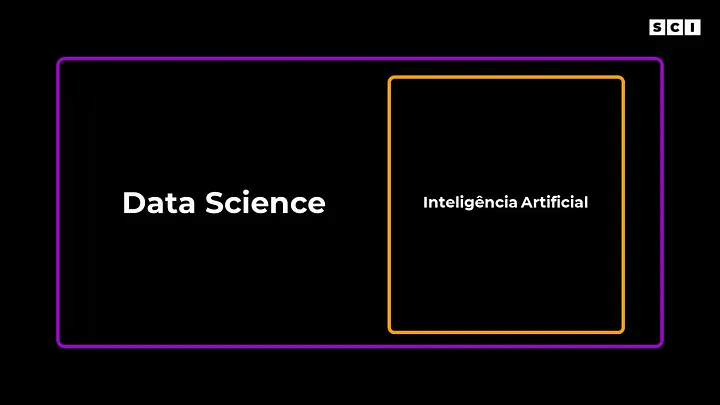

### Machine Learning (ML)

O Machine Learning (em português, aprendizado de máquina) é uma das subáreas de maior sucesso dentro da Inteligência Artificial. Isso se dá porque o machine learning é uma forma diferente de lidar com problemas que até então eram insolucionáveis.

Para entendermos o que é machine learning, primeiro vamos entender o que não é machine learning. Chamaremos esse lado de “programação tradicional”.

Imagine a seguinte situação: você foi na padaria e comprou alguns pães e doces. Para pagar o seu gasto no caixa da padaria você vai usar seu cartão de débito. O valor total do seu gasto é de R$ 25 e você tem de saldo no seu banco R$ 100.

Para validar essa transação existem diversas regras que foram criadas pela empresa do seu cartão e do seu banco. Essas regras foram definidas por algum ser humano e explicitamente programadas no sistema de validação das transações.

Ou seja, em alguma parte do código o seu banco valida o valor que você quer gastar e o valor que você tem disponível na sua conta corrente (além do seu limite de cheque especial) para aprovar ou negar a compra.

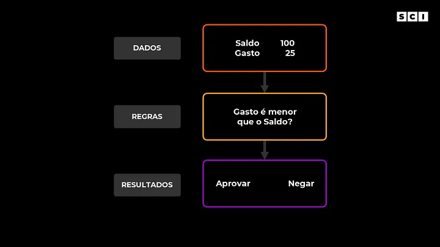

Mas, o que tem de importante nessa situação descrita acima? Para solucionar esse problema (validar se podemos aprovar a transação ou não) criamos regras que são explicitamente definidas por nós seres humanos. Então, podemos resumir esse tipo de problema da seguinte forma:

Recebemos dados (neste caso, valor da compra e saldo disponível na conta corrente), aplicamos as regras que definimos e no final geramos a resposta se a compra foi aprovada ou negada. Fazemos tudo isso usando “programação tradicional” (veja o esquema a seguir que resume essa ideia).

Entretanto, não somos capazes de definir regras explicitamente para todos os problemas, e justamente nesses casos que entra o machine learning. Vamos imaginar um outro problema: como você sabe que um animal é um gato ou um cachorro. Esse problema aparentemente é simples (até crianças conseguem diferenciar gatos de cachorros), entretanto tente escrever em um papel de forma detalhada o que faz um gato ser um gato e um cachorro ser um cachorro.

Rapidamente você vai notar que essa tarefa simples que seu cérebro faz de maneiro instantânea é difícil de ser declarada de forma explícita. Os animais podem ter tamanhos, cores, raças e características muito diferentes.

O machine learning traz uma forma diferente de olhar para esse tipo de problema. Diferentemente da programação tradicional, no ML recebemos dados e as respostas e o próprio algoritmo cria as regras (veja o esquema abaixo que resume essa ideia). Para fazer isso, os algoritmos de ML procuram padrões e a partir deles criam as regras buscando acertar a maior quantidade possível de exemplos.

> Essa ideia descrita acima não é 100% verdade. Na prática nem sempre os algoritmos buscam acertar o máximo de exemplos, mas sim otimizar uma função. Mas essa ideia fica para um próximo post.

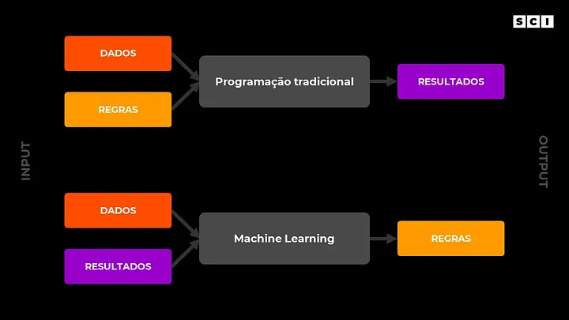

Veja um exemplo prático do como o Google Maps usa machine learning para criar a melhor rota e prever o tempo de chegada:





Sendo assim, vamos representar este terceiro conceito em nosso diagrama. O Machine Learning é uma subárea da inteligência artificial, então ele está contida dentro dela:

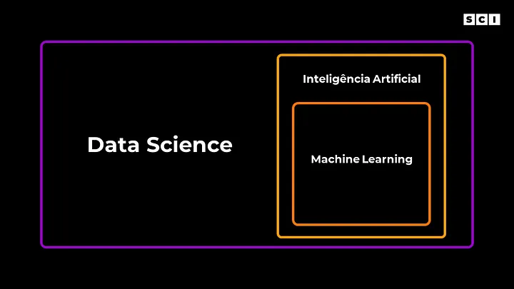

### Deep Learning (DL)

O Deep Learning (em português, aprendizado profundo) é uma subárea do machine learning, que se concentra em algoritmos inspirados no funcionamento do cérebro humano, conhecidos como redes neurais artificiais.

É exatamente o que você está pensando, existe uma classe de algoritmos que foram inspiradas no nosso cérebro. E não é só isso, esses algoritmos têm se mostrado muito superiores para uma série de tarefas, como visão computacional, processamento de linguagem natural, predição de séries temporais entre outros.

Para ficar mais claro o que é deep learning, vamos entender o que são as redes neurais artificiais (ANNs). Como falamos anteriormente, as ANNs são basicamente algoritmos inspirados no cérebro humano. De forma extremamente simplificada, temos a entrada de um estímulo, um processamento e uma saída que pode estimular outro neurônio (ou não). E as redes neurais artificiais tentam replicar essa ideia usando matemática e computação (veja a imagem a seguir).

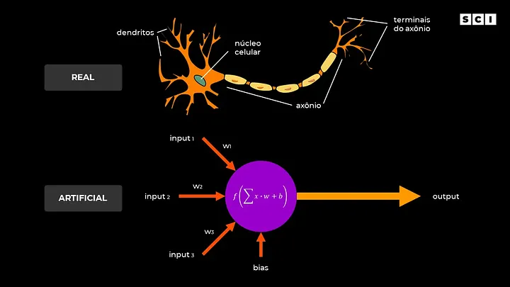

> Um fator importante: as redes neurais artificiais não têm como objetivo replicar as redes neurais biológicas, mas sim resolver problemas práticos. Coincidentemente (ou não), essa abstração do modelo biológico tem funcionado muito bem!

O termo “deep” foi usado em 2006 pelo psicólogo cognitivo e cientista da computação Geoffrey Hinton como uma forma de descrever redes neurais profundas, ou seja, com várias camadas de neurônios. Uma rede neural não profunda é um algoritmo de machine learning, enquanto redes com várias camadas são consideradas deep learning (veja o exemplo a seguir).

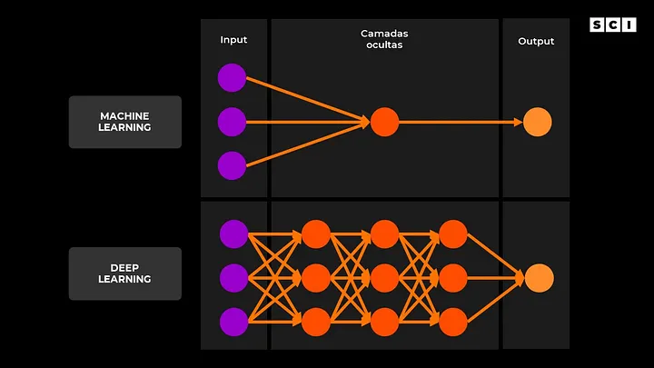

> Esses conceitos podem parecer abstratos e difíceis de entender. Abordaremos essa ideia em um post futuro.

Um exemplo prático são as redes neurais do Autopilot da Tesla para identificar objetos:

 


Chegamos ao último conceito. Podemos representá-lo como um subárea do machine learning:

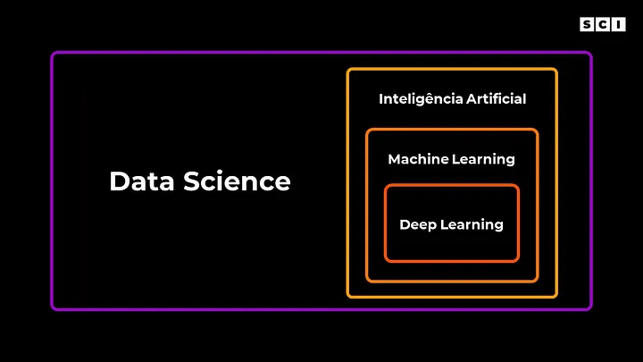

## Para conhecer mais
Se você curtiu o conteúdo e quer conhecer mais sobre o assunto dê uma olhada nesses conteúdos:

 



  
  


Espero que esse post possa te ajudar a entender melhor cada um dos principais conceitos da área de dados, a relação entre eles e como são aplicados em nosso dia a dia.

Nos vemos em breve!