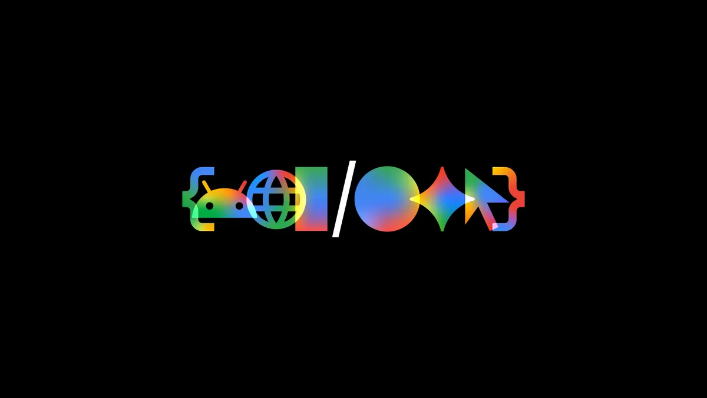
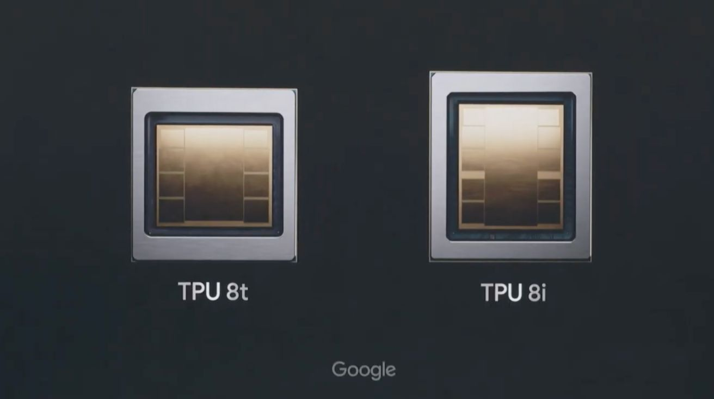
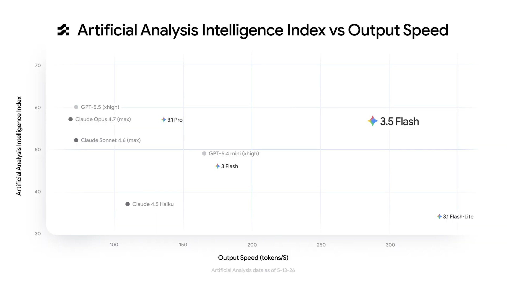
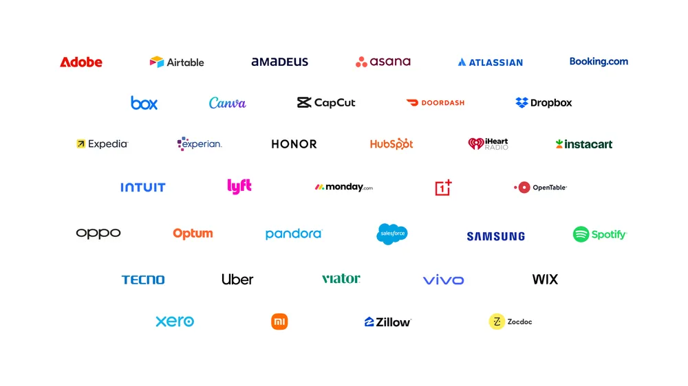
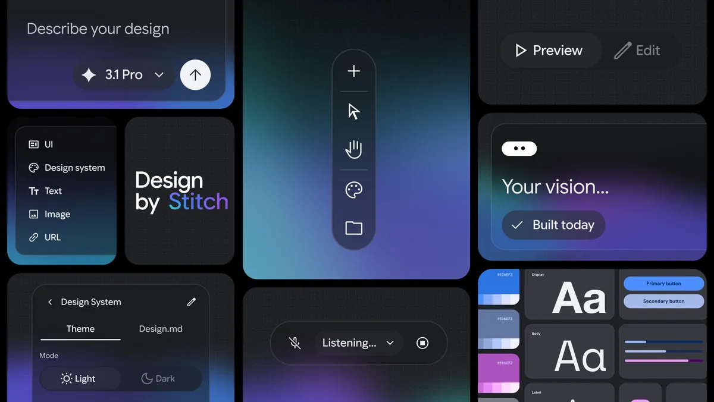
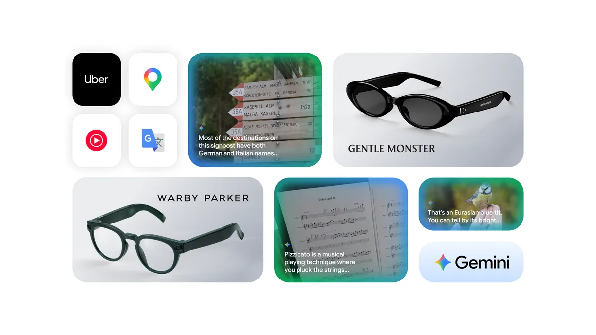

Essa semana aconteceu mais uma edição do Google I/O apresentando novidades do ecossistema de produtos. Nesse post eu trago um resumo das novidades e algumas reflexões sobre o mercado.

Longe de discussões teóricas ou promessas futuras, os números da empresa mostram uma realidade muito positiva. O Google possui hoje 13 produtos com mais de 1 bilhão de usuários cada, sendo que 5 deles têm mais de 3 bilhões. O AI Overviews tem 2,5 bilhões de usuários ativos mensais, impulsionado diretamente por sua localização privilegiada na interface de busca.

O uso do Gemini atingiu a marca de 900 milhões de usuários ativos mensais em abril de 2026. A integração dos novos produtos de IA ocorre sobre um ecossistema completo de produtos já estabelecidos e uma base instalada de clientes já consolidada. Dois fortes diferenciais competitivos do Google na corrida da AI.

Enquanto o mercado debate a sustentabilidade financeira de startups dedicadas exclusivamente à IA, o Google tem resultado recorrente muito forte. A Alphabet projeta um investimento em CapEx entre 180 e 190 bilhões de dólares para este ano, um aumento de aproximadamente seis vezes em relação a 2022. Essa força financeira permite direcionar investimentos massivos e consistentes para iniciativas de longo prazo, sem qualquer dependência de capital externo.

Esse foi mais um ano de grandes novidades, principalmente em produtos de IA. Segue um resumo:

## Hardware

O desenvolvimento de hardware proprietário continua sendo um dos maiores diferenciais competitivos do Google. Com mais de uma década de desenvolvimento focado em sua linha de processadores customizados, a empresa anunciou dois modelos especializados: o TPU 8t, otimizado para o treinamento de grandes modelos, e o TPU 8i, otimizado para inferência.

Essa especialização ataca problemas críticos: custo e eficiência. Ao criar o hardware proprietário e integrar com software também proprietário, como o JAX, o Google reduz drasticamente sua dependência de fornecedores externos. Na ponta da operação, essa estratégia significa menor latência para o usuário, menos custos de processamento e maior velocidade na construção de novos modelos e produtos.

## Modelos e Agentes

### Gemini Omni

No campo dos modelos de fundação, o destaque foi o **Gemini Omni**. O modelo de mundo multimodal focado na consistência de objetivos e conceitos de física, permitindo a geração de vídeos de alta fidelidade a partir de diversos formatos de entrada (texto, áudio, imagens ou vídeo).

 


### Gemini 3.5 Flash

Para eficiência pura de custos, foi apresentado o **Gemini 3.5 Flash**. Um modelo focado em alta velocidade de geração de tokens com capacidade de processamento analítico comparável aos modelos top de linha do mercado. A eficiência operacional do Flash foca na redução dos custos ao consumir o modelo em larga escala (uma grande diferença no orçamento de IA para as empresas).

### Antigravity 2.0

O lançamento do **Antigravity 2.0** mostra uma mudança no fluxo de desenvolvimento. A ferramenta deixa o modelo de IDE tradicional para focar estritamente na orquestração e gerenciamento de **Agentes**.

Na prática, o desenvolvedor agora trabalha combinando dois programas. O Antigravity centraliza a delegação de tarefas e o contexto do projeto, enquanto qualquer **IDE de preferência** do usuário serve como interface para visualizar e editar o código manualmente.

Essa mudança consolida uma transição clara no papel do profissional. O foco deixa de ser a escrita de código para se tornar o **gerenciamento de conhecimento**.

 


### Gemini Spark

O Gemini Spark funciona como um agente pessoal focado na execução autónoma de tarefas. Ele roda continuamente, 24 horas por dia, sete dias por semana, operando em uma máquina virtual. O usuário pode enviar múltiplas demandas em uma única requisição, e o sistema quebra essas tarefas para executá-las em paralelo. Como o processamento ocorre em segundo plano, os fluxos continuam ativos mesmo após fechar o aplicativo. 

O diferencial estratégico está na integração com o ecossistema. **O agente possui acesso nativo ao Gmail, Google Drive e Chrome**, com expansão prevista via protocolo **MCP para ferramentas de terceiros** e gerenciamento das tarefas no Android Halo (disponível em breve).

Essa capilaridade técnica resolve o principal gargalo dos agentes atuais: o contexto. Ao consolidar os dados históricos e as ferramentas que o usuário já utiliza, o Google cria uma barreira de entrada difícil de ser replicada pela concorrência.

## Busca

### Interface

A interface de busca passa pela sua maior transformação dos últimos 25 anos, aproximando-se de um modelo puramente conversacional. O crescimento consolidado do **AI Mode** ao longo do último ano alterou radicalmente a dinâmica de navegação.

Particularmente, sinto essa mudança no dia a dia. A inserção de termos tornou-se mais longa, natural e descritiva, eliminando a carga cognitiva de tentar adivinhar as palavras-chave exatas. A consequência é que eu acesso sites do resultado da busca muito menos do que antes.

A nova proposta integra nativamente a busca tradicional, o AI Overviews e interações multimodais com textos, imagens e arquivos em um único fluxo contínuo.

### Agentes

Além da mudança de interface, a busca passará a integrar Agentes. O usuário poderá configurar tarefas complexas diretamente na barra de pesquisa, como monitorar o mercado imobiliário sob critérios restritos de preço e localização.

O Agente executa a varredura na internet em segundo plano de forma contínua. O sistema trabalha de maneira assíncrona e envia notificações consolidadas apenas quando encontrar algo relevante.

### Generative UI

A inovação mais diferente é a capacidade de **Generative UI**, alimentada pela integração com o Antigravity na busca. A partir de uma necessidade do usuário, o sistema interpreta a intenção do usuário, escreve o código em tempo real e renderiza componentes ou widgets interativos totalmente customizados para aquela necessidade.

É possível interagir, evoluir as funções do widget e consolidá-los em um dashboard personalizado. Essa operação em escala para bilhões de requisições só se torna viável devido à velocidade do **Gemini 3.5 Flash**, que processa e executa a aplicação gerada dentro de um container Docker individual em segundos.

 


## Google Shopping

### Compras com Agentes

Mais de 1 bilhão de pessoas realizam compras diariamente através do Google, que consolidou um catálogo massivo com mais de 60 bilhões de produtos listados. Para transformar essa vertical, o ecossistema introduziu três pilares de arquitetura de software:

* **Universal Commerce Protocol (UCP):** Um padrão open source desenvolvido para normatizar a comunicação técnica direta entre agentes de IA e vendedores.  
* **Agent Payments Protocol (AP2):** Protocolo focado em transações seguras, permitindo que os agentes concluam compras de ponta a ponta em nome do usuário, respeitando limites e premissas financeiras pré-estabelecidas.  
* **Universal Cart:** Um carrinho de compras inteligente e agêntico que opera de forma transversal entre diferentes lojistas da internet.

Na prática, o usuário pode adicionar itens ao “carrinho universal” do próprio Google enquanto navega pelo YouTube, Gmail, Gemini ou Busca. Os agentes comparam preços, emitem alertas de descontos e validam a compatibilidade técnica dos itens (como checar se uma placa-mãe é compatível com um processador específico). A transação pode ser finalizada diretamente via Google Wallet, sem a necessidade de acessar o site do lojista.

### Impacto no Varejo

Vejo um impacto grande para os varejistas tradicionais nesse modelo. Ao centralizar toda a jornada dentro do ecossistema agêntico do Google, os lojistas perdem o controle direto sobre a experiência de navegação do cliente e o poder de barganha de suas plataformas.

O resultado provável será uma comoditização ainda maior dos produtos. A decisão de compra ficará concentrada puramente em preço e tempo de entrega, o que deve comprimir margens operacionais que já são historicamente apertadas.

## Gemini App

O aplicativo Gemini atingiu a marca de 900 milhões de usuários ativos mensais. Após um ano marcado por lançamentos como o Gemini Nano Banana, Veo e Lyria, além da integração com o NotebookLM, o produto recebe uma atualização em seu design.

### Neural Expressive

A interface foi completamente redesenhada sob uma nova linguagem de design chamada **Neural Expressive**. O foco está na usabilidade sensorial, trazendo animações fluidas, feedback tátil e uma identidade visual que facilita a encontrabilidade de recursos e a geração de conteúdo.

### Agentes no Gemini

A evolução do app marca a transição de um assistente consultivo para um executor de ações. O primeiro grande reflexo disso é o **Daily Brief**, um organizador matinal alimentado pelo Gemini Spark. Ele não se limita a resumir dados: o agente cruza informações do seu calendário, emails e gerenciadores de tarefas para estruturar e planejar ativamente o fluxo do seu dia.

Para os próximos meses, o ecossistema projeta uma expansão via protocolo **MCP** (Model Context Protocol). Essa integração vai permitir que o Gemini interaja nativamente com aplicativos de terceiros, aproveitando uma base já consolidada de parceiros de peso que aderiram ao padrão técnico do Google.

### Outras melhorias

* **Experiência Live Expandida:** Inclusão de novas vozes nativas com suporte a sotaques e variações regionais para interações por áudio mais naturais.  
* **Respostas com Generative UI:** O aplicativo deixa de ser um chat puramente textual. As respostas agora renderizam componentes interativos, widgets, imagens e vídeos dinâmicos diretamente na tela.  
* **Motor Omni integrado:** O modelo Gemini Omni estará disponível nativamente no app, permitindo a criação e edição técnica de vídeos diretamente pela interface do usuário.

## Criatividade

### Google Pics

No ecossistema Workspace, o Google Pics surge como uma ferramenta dedicada para criação e edição de imagens, permitindo isolar, manipular e remover objetos específicos de uma cena de forma direta.

### Stitch

Para a frente de design de interface, foi apresentado o Stitch. A ferramenta gera componentes de UI a partir de inputs em texto e permite a edição granular do layout conforme a necessidade do projeto. O design gerado pode ser exportado nativamente para o Google AI Studio, Antigravity ou Figma.

### Google Flow

A plataforma focada na produção de mídias recebeu atualizações estruturais em vídeo, imagem e áudio:

* **Agentes no Flow**: O sistema agora orquestra a geração de múltiplos vídeos em paralelo e automatiza edições específicas em grande volume.  
* **Flow Tools**: Introdução de recursos baseados em *vibe coding*, permitindo que o usuário desenvolva e compartilhe suas próprias ferramentas customizadas de edição dentro da plataforma.  
* **Flow Music**: Um ambiente de co-criação musical onde artistas utilizam o modelo para estruturar arranjos, enviar ideias de composição e desenvolver faixas de forma colaborativa.

 


## Intelligent Eyewear

Foi anunciado o novo óculos **Audio Glasses**. Desenvolvidos em parceria com a Samsung, Gentle Monster e Warby Parker, os óculos inteligentes funcionam conectados ao celular para permitir uma experiência de mãos livres.

O sistema utiliza o Gemini de forma contextualizada para interpretar o ambiente e comunicar-se com o usuário puramente por voz, de forma privada. A projeção é que a exibição de conteúdos diretamente na lente seja disponibilizada no final do ano. Tenho muita expectativa para esse produto.

## Gemini for Science

### Ferramentas para pesquisa

As aplicações práticas em pesquisa ganharam um conjunto de ferramentas dedicadas sob o ecossistema **Gemini for Science**. O objetivo é acelerar o ciclo de descobertas científicas através de recursos específicos:

* Literature Insights: Assistente focado em ajudar pesquisadores na triagem e no acompanhamento automatizado de novos artigos científicos.  
* Computational Discovery: Motor que converte objetivos macro de pesquisa em código executável  
* Gerador de hipóteses com base no contexto de pesquisa

### Saúde

A **Isomorphic Labs** está utilizando os modelos para mapear e modelar interações moleculares, redesenhando o processo tradicional de descoberta de medicamentos.

Projetos voltados para o tratamento de câncer e doenças imunológicas já avançaram para a **fase pré-clínica**. A ambição de longo prazo é transformar o processo de descoberta de medicamentos, para um dia resolver todas as doenças.

 


## Conclusão

As novidades apresentadas deixam claro que o Google está décadas à frente de concorrentes nativos de IA, como OpenAI e Anthropic. Essa vantagem não está apenas na força financeira para investir em infraestrutura e ciência, mas fundamentalmente no poder do seu ecossistema.

Os produtos proprietários (e seus dados) fornecem o contexto que os modelos de IA precisam para gerar valor. Além disso, muitos desses produtos têm um efeito de retenção (*lock-in*) forte no dia a dia de bilhões de pessoas e a competição torna-se assimétrica.

A tese original que motivou a fundação da OpenAI parece estar se concretizando: sem uma alternativa, o Google assumiria o domínio do setor.

O mercado ainda enfrentará incertezas, inovação e mudanças regulatórias. No entanto, o principal fator de diferenciação nesta corrida não será a sofisticação dos modelos, mas sim o ecossistema construído ao redor dela. E, nesse aspecto, o Google larga com uma distância absurda a frente de qualquer concorrente.