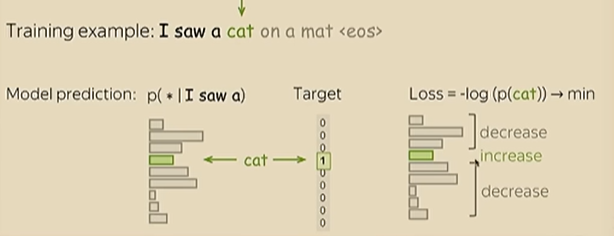
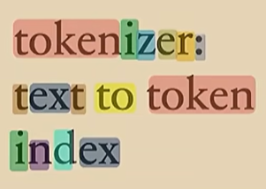
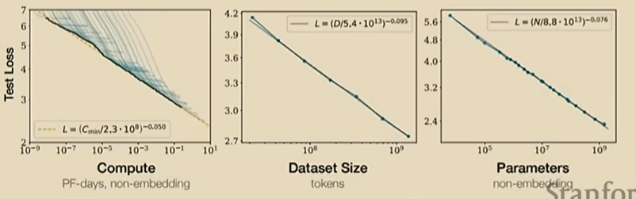
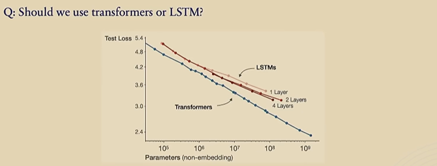
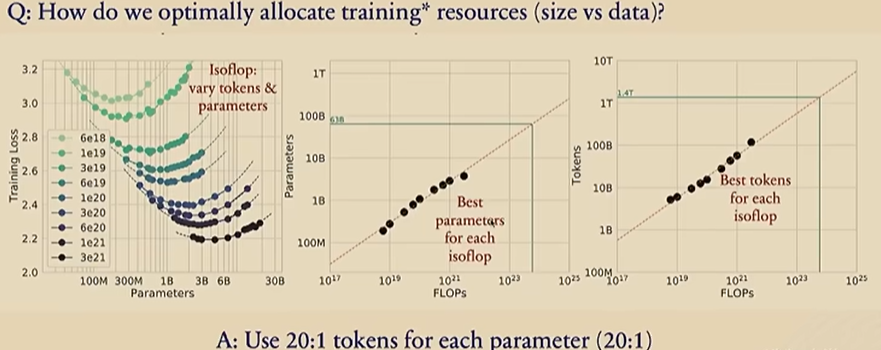
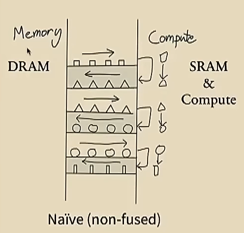
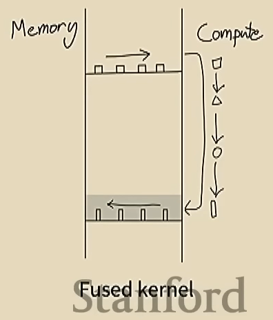

Essas são anotações da aula CS229 sobre LLMs, lecionada por Yann Dubois. 

A aula está disponível no [Youtube ↗](https://www.youtube.com/watch?v=9vM4p9NN0Ts)

## Anotações

### O que importa em LLMs?

1. Arquitetura
2. Treinamento de modelos
3. Dados
4. Avaliação
5. Sistemas

O item 1 e 2 são os mais estudados na academia, mas o professor aponta que o 3, 4 e 5 são os mais relevantes na prática.

### Duas fases de um LLM

1. **Pretraining:** modelar baseado nos dados disponíveis (GPT3)
    - Tokenização e Loss
    - Avaliação
    - Dados
    - Leis de escala
    - Sistemas
2. **Post-training:** transformar os modelos em assistentes de IA (ex: Chat GPT). Aqui é basicamente transformar o modelo em um produto customer facing.
    - Supervised Fine Tuning (SFT)
    - Reinforcement Learning from Human Feedback (RLHF)

## Conceitos

### Language Modeling

- É criar um modelo que calcula a distribuição de probabilidades a partir de uma sequência de palavras/token, p(x1, x2, xn). Esse modelo dá a probabilidade dada a sequência de palavras recebidas de input. Ele consegue pegar características da sintaxe e da semântica das frases.
- São generativos porque podem gerar dados, como texto.
- Os modelos usados atualmente são Autoregressivos (pega a distribuição de probabilidades da primeira palavra e multiplica pela distribuição da segunda palavra dado a primeira, depois a terceira dado a primeira e segunda e assim por diante:

\[
p(x_1, x_2, \dots, x_n) = p(x_1) \, p(x_2 \mid x_1) \, p(x_3 \mid x_1, x_2) \, \dots \, p(x_n \mid x_1, x_2, \dots, x_{n-1})
\]

- Então, basicamente é calcular a probabilidade da próxima palavra/token dado o passado.

### Autoregressive Language Models

Passos:
- Tokeniza (gera um id para cada token)
- Passa pelo modelo
- Prediz o próximo token
- Amostra a distribuição de token preditos
- Detokenize (transforma no valor do token)

No processo de treinamento do modelo, uma sequência de token é recebida e é predito o token mais provável. O toke predito é comparado com o valor real, fazendo o ajuste nos parâmetros do modelo.

### Autoregressive Neural Language Models

- Todos os tokens/palavras passam por um embedding que gera uma representação vetorial de cada um.
- Os vetores passam pela rede neural (transformers).
- Passa por uma camada que lineariza a saída pela quantidade de token existentes.
- Passa por uma função softmax, chegando a uma distribuição de probabilidades.

## Pretraining

### Loss do treinamento
- O objetivo é classificar o próximo token dado uma sequência: "Eu vi um ..."
- O valor predito é comparado com o real, e é usado cross-entropy, que aumenta a probabilidade de gerar o token target e reduz os outros.

### Tokenização

**Porque é necessário?**
- Tokens são mais genéricos que palavras (nas palavras podem ter erros de escrita)
- Geram sequências mais curtas do que se cada carácter fosse usado como input (reduz a complexidade de computação)

**O que é?**
- Token são subsequências (~3 letras)

**Como funciona a tokenização?**
- Pega um corpus grande de texto
- Começa com um token por carácter
- Toda vez que tiver um par de tokens comum (que aparece múltiplas vezes no corpus) ele junta os dois caracteres em um só
- Repete o processo de junção dos token até atingir o tamanho de vocabulário desejado

Exemplo:

### Avaliação

- A forma como os LLMs são avaliados é chamado de **Perplexity**: 
    - É uma medida de quão “surpreso” o modelo fica ao ver os dados de teste, ou seja, quão incerto ele está nas previsões.
    - Quanto menor a perplexity, melhor: significa que o modelo está atribuindo probabilidades maiores às sequências que realmente ocorrem (menos “surpresa”).
    - O valor da Perplexity varia entre 1 (acertou perfeitamente) e 1/(tamanho do vocabulário)
- Com a evolução dos modelos (entre 2017 e 2023) os modelos reduziram a incerteza das predições de ~70 tokens para menos de 10 tokens.
- Na academia a medida Perplexity não é tão usada como benchmark (porque depende de vários fatores, como tokenização), mas é bastante usada no treinamento de modelos no mercado.

**Avaliações e Benchmarks na academia**

- Usam as formas clássicas de avaliar modelos NLP, através de avaliações automáticas em diferentes benchmarks:
    - HELM (Holistic Evaluation of Language Models): perguntas e respostas com resposta certa, onde avalia a resposta do LLM versus a esperada.
        - Exemplo: MMLU, um benchmark que tem diversas perguntas de diferentes áreas do conhecimento. Uma pergunta com múltipla escolha.
    - Huggingface Open LLM Leaderboard
- Diferentes empresas e organizações usam versões diferentes para avaliar seus modelos nos benchmarks, então é difícil compará-los.
- Existe um desafio de saber se os modelos foram treinados com os testes para pessoas de fora das empresas e organizações que treinaram o modelo (eles sabem o que foi de input).
- Há algumas estratégias que estão sendo testadas para avaliar quando um modelo vai bem no teste exatamente como ele é e como ele vai quando há mudanças.

### Dados

Basicamente é usado o conteúdo de "toda a internet". Mas a internet tem dados muito "sujos" e não representativos do que se quer usar no treino dos modelos.

Na prática é assim que os dados são gerados:
1. São usados crawlers para navegar na internet e baixar o conteúdo.
    - Geralmente não se desenvolve seu próprio crawler, mas sim, usasse algum já pronto: Common crawl - 250b páginas, total de 1PB
2. O texto é extraído do HTML (diversos desafios)
3. Filtra conteúdos indesejáveis (ex: PII, conteúdos impróprios)
4. Remover conteúdo duplicado
5. Filtros heurísticos: remover conteúdos de baixa qualidade (baseado tokens diferentes, conteúdos muito grandes ou muito pequenos e etc)
6. Filtros baseados em modelos, exemplo modelo que avalia se um conteúdo é da wikipedia ou não (se for, tem qualidade para seguir).
7. Dados são classificados em categorias, por domínios (livros, código, entretenimento). O peso para cada domínio é ajustado (aumentado ou reduzido).

Depois de treinar o modelo com esses dados mais gerais, o modelo é treinado em um base com qualidade muito alta (como Wikipedia).

Coletar bons dados é a chave para criar bons LLMs

Esse processo é pouco falado porque gera um diferencial competitivo e pode gerar problemas com copyright.

Alguns datasets famosos na academia:
- C4 (150B token, 800gb)
- The Pile (280B tokens)
- Dolma (3T tokens)
- FineWeb (15T tokens)

Comparando com modelos privados:
- LLaMA 2 (2T tokens)
- LLaMA 3 (15T tokens)
- GPT-4 (~13T tokens)

### Leis de Escala

**O que é?**

Foi demonstrado de forma empírica que quanto mais dados e modelos maiores, melhor a performance.

Overfitting não acontece com LLMs

Dado a lei de escala, é possível prever a performance de um modelo dado a quantidade de dados e o tamanho dos modelos? (paper Scaling laws, 2020 - OpenAI)

As leis de escala mudaram a forma como se treina os modelos.

Antes
- Os parâmetros de grandes modelos era tunados, testando diferentes parâmetros (ex: 1 modelo por dia)
- Depois de 30 dias, escolhia o final, com base e qual foi melhor nos dias.

Agora:
- Encontrar um padrão usando as leis de escala e segue ela
- Tuna os parâmetros em modelos pequenos de diferentes tamanhos (ex: por 3 dias)
- Extrapolar usando as leis de escala, quão versão teria uma performance melhor se treinar com modelos maiores (tentar prever quão bom ele será em uma escala maior, fazer uma projeção da performance dado pontos de performance x tamanho do modelo)
- Treinar o modelo final (ex: por 27 dias)


  **Insight:** me parece seguir a mesma lógica do desenvolvimento de produto e startups (testar rápido, barato e pequeno, aprender e depois escalar).


Exemplo: LSTM vs Transformer

Existe um paper (Chinchilla, 2022) que mostra como otimizar a alocação de recursos no treinamento de modelos, avaliando tamanho do modelo (quantidade de parâmetros) e dados (quantidade de tokens)

A partir dessa análise é possível ter uma noção de quantos parâmetros são necessários dependendo da quantidade de tokens para otimizar a performance.

Além disso, as empresas também levam em consideração o custo da inferência (que não é incluído neste estudo).

No geral, as empresas preferem ter um modelo menor porque o custo da inferência será menor em produção.
- Resultado do paper: 20 token para cada parâmetro
- Proporção usada na prática: 150 tokens para cada parâmetro.

#### Treinamento

Quanto custa treinar um LLM?

Exemplo:

LLama 3 400B (Dados: 15,6T tokens, Parâmetros: 405B) ~40 token/param (otimizado para treinamento)

- **FLOPs** (quantas operações de ponto flutuante o modelo executa durante o treinamento) pode ser obtido pela fórmula:

$$\text{FLOPs} \approx 6 \times (\text{n de parâmetros}) \times (\text{n de tokens})$$

- Existe uma regulação que modelos com mais de 10^26 FLOPs precisam passar por *"special scrutiny"*. Empresas fazem modelos abaixo para não ter que lidar com isso (ex: LLaMA 3 ~3.8 e25 FLOPs)
    

  **Special Scrutiny** significa que acima de certo nível de poder computacional, o modelo entra em uma categoria que exige auditoria, segurança e transparência especiais, devido ao seu potencial de risco e impacto.


- **Poder de computação:** NVIDIA 16K H100 ~400 TFLOPS
- **Tempo:** 3.8e25 / (400e12 * 3600) = 26M GPU hour / (16e3 * 24) = 70 dias
- **Custo:** aluguel das GPUs + salário = ~$2/h * 26Mh + 500k/y * 50 employee = $52M + $25M = ~$75M
- **Carbono emitido:** 4400 tCO2eq (~2mil vôos de NY para Londres)

### Sistemas

A computação é essencial para treinar os modelos, porém ela é limitada e é o gargalo atualmente, então a otimização dos recursos é ainda mais importante.

Por que não comprar mais GPUs?
- Caras e escassas (mesmo com dinheiro é difícil ter acesso as melhores GPUs hoje)
- Limitação física (é necessário fazer as GPUs se comunicarem entre si, isso dá trabalho e leva tempo)

#### GPUs

- Paralelização massiva
- Otimizado para multiplicação de matrizes (será mais rápido, mas te "obriga" a fazer tudo com multiplicação de matrizes)
- A computação evoluiu mais rápido do que memória e comunicação (muitas GPUs ficam ociosas durante o processo)

Métrica usada: Model Flop Utilization (MFU) - mede o percentual de utilização das GPUs (50% é bom! Mesmo grandes empresas têm problemas com isso, os dados chegam mais devagar do que o esperado).

Um caminho para contornar isso:
- Usar menos bits, aumenta a velocidade de comunicação e menos memória consumida
- A precisão no deep learning não é tão relevante
- É usado Automatic Mixed Precision (algumas coisas são em 32 bits outras em 16 bits)
- A computação é feita em 16 bits, mas os pesos dos modelos são armazenados em 32 bits.

**Operator Fusion**

Como a comunicação é lenta, quando temos várias processos que serão executados (ex: várias linhas de código no PyTorch), tem um desperdício no processo de:
1. Levar o dado da memória para a GPU
2. Computar
3. Devolver o dado computado da GPU para a memória
4. Repetir

Uma solução para isso é se comunicar apenas uma vez, realizar todos os cálculos e, só então, devolver para a memória.

Para isso é possível compilar o código em C++ e CUDA para otimizar esse processo.

## Post-training

### Objetivo

**Porque existe o post-training?**

O post-training existe para transformar modelos em "Assistentes de IA". O modelo linguagem "puro" não é o que queremos (ele não segue as instruções e fornece a resposta que queremos, mas sim, textos mais prováveis dado o input).

Para isso é feito o *"alignment"*.

**Alignment**

- Objetivo é fazer o LLM seguir as instruções dos usuários e designers (ex: moderação)
- Durante o Pretraining usamos muitos dados (estão disponíveis), mas não são exatamente o que queremos (pensando no uso do modelo)
- Os dados que queremos são poucos e caros
- Então a ideia é fazer o pré-treino do LLM com "toda a internet" (fazendo com que o modelo aprenda coisas gerais, ex: como falar português) e depois fazer ***fine tunning*** com apenas dados desejados com alta qualidade.

### Supervised Fine Tuning (SFT)

- A ideia é fazer um ajuste "fino" nos parâmetros do LLM para ele gerar as respostas desejadas
- Para isso é usado um modelo supervisionado que faz linguagem modeling (prevê a próxima palavra) em dados definidos por humanos (essa é a pergunta e essa é a resposta desejada).
- Esse processo é o que faz a transição do GPT3 (conhecido por cientistas) para Chat GPT (produto).

#### Escala de dados para SFT

- Hoje é devagar e caro coletar esses dados
- Uma ideia é usar os LLMs para escalar a coleta (ex: Alpaca)
    - Isso foi feito no projeto Alpaca: baseado em perguntas e respostas qualificadas por humanos, um LLM gera novas perguntas e respostas similares. Esses dados são usados no supervised fine tunning em um modelo pré treinado.
- Existe um campo grande de *synthetic data generation*
- Não é necessário uma quantidade tão grande de dados para SFT (apenas milhares). As leis de escala não fazem tanto efeito aqui.
- Por que poucos dados têm tanto impacto? Porque são usados diferentes parâmetros, a learning rate é aumentada, tendo mais peso na atualização dos parâmetros.
- O conhecimento já está no LLM pré treinado, mas nessa etapa ele aprende o formato de resposta esperada (tamanho, separar em tópicos etc)


  **Insight:** o importante é colocar o humano no loop. Ao invés do humano gerar 100% do conteúdo ele faz correções e ajustes. É mais rápido e melhora o modelo com essas informações adicionais.


### Reinforcement Learning from Human Feedback (RLHF)

O SFT clona o comportamento dos humanos que deram as respostas e isso gera alguns problemas:

1. Limitado pelas habilidades humanas (mesmo os humanos sendo bons em distinguir bons conteúdos de maus, nem sempre são capazes de produzir bons conteúdos)
2. Alucinação: se a resposta dada pelos humanos durante o SFT, não for conhecida anteriormente (pré treino), isso pode fazer com que o modelo tente gerar uma resposta plausível, ao invés de usar de fato a referência conhecida.
3. Custo: criar respostas boas são caras.

Desta forma, o RLHF vem para contornar isso. Ao invés de clonar o comportamento humano, ele tenta maximizar sua preferência. Para isso:

- Dado uma input, são gerados 2 respostas.
- Pessoas selecionam as preferidas.
- É feito fun tuning com base nas respostas preferidas.

Era usado um método chamado PPO. Agora existe um novo método chamado DPO (que maximiza as respostas que os usuários gostam e minimizam as que não).

Desafios no RLHF:
- Devagar e caro.
- Difícil de focar na qualidade versus a forma do conteúdo (ex: pessoas normalmente classificam respostas maiores como melhores).
- A distribuição dos assuntos na rotulagem muda o comportamento do modelo.
- Ética na terceirização e exposição de pessoas que rotulam a conteúdos tóxicos.

Uma ideia é substituir a preferência dada por humanos por preferência de outros LLMs (os seres humanos têm muita discordância em suas preferências).

### Avaliação

Como avaliar um LLM *aligned* (no post-training)?

Desafios:
- Não existe uma única resposta certa e as respostas são ilimitadas
- Não se pode usar validation loss ou perplexity
- Podem ser feitas perguntas de diversos temas, então tem muitas coisas que precisam ser avaliadas

Uma ideia é pegar respostas do LLM que foram dadas para perguntas de humanos e rotuladores definirem qual a melhor resposta (o mesmo processo do RLHF), ex: ChatBot Arena (humanos falando com chatbots e recebem respostas de dois modelos e definem a resposta preferida)

## Mais conteúdos

- CS224N: contexto histórico
- CS324: mais detalhes sobre LLMs
- CS336: construir seu próprio LLM