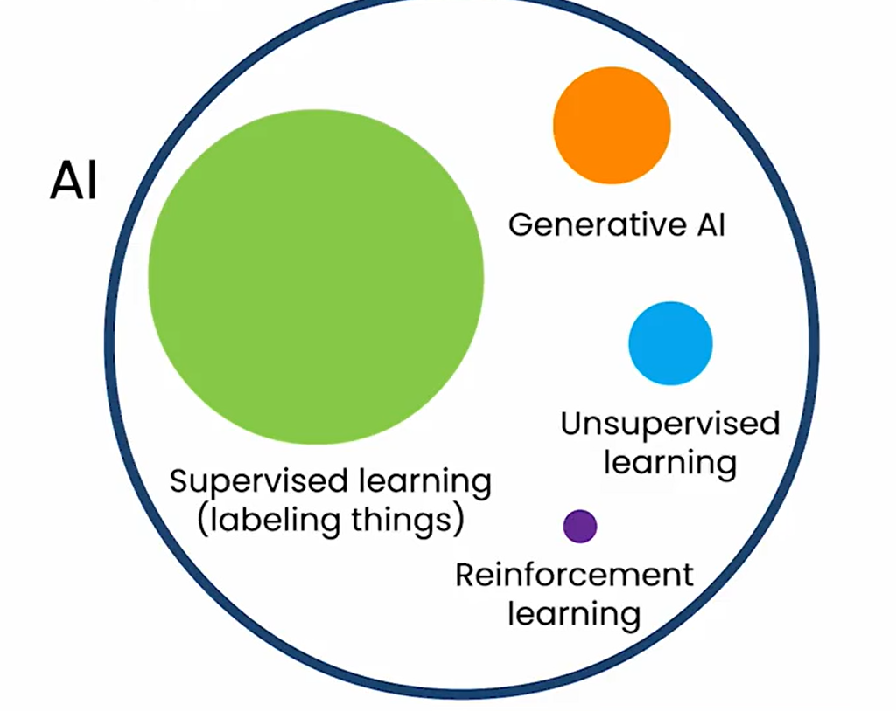

## Intro

### Crescimento de GenAI

- Começou a crescer e ganhar atenção em novembro 2022 (quando a OpenAI lançou ChatGPT)
- McKinsey estima uma adição de $2.6-$4.4 trilhões ao ano para a economia.
- Goldman Sachs estima crescimento de 7% no GDP global nos próximos 10 anos.

### O que é?

Sistemas de IA que podem produzir conteúdos de alta qualidade, como texto, imagens e áudio.

Ex: ChatGPT, Gemini

Mas também é uma ferramenta para desenvolvedores

## Como GenAI funciona?

Atualmente existe um hype muito grande em relação a IA.

- IA é um conjunto de ferramentas
- Supervised learning e GenAI são os mais relevantes atualmente

As pesquisas mais recentes mostram que a performance de modelos muito grandes aumenta a medida que mais dados são usados nos treinamento. Diferente do que acontece com modelos pequenos, onde mesmo adicionando mais dados a performance chegava em um platô.

Essa ideia de modelos muito grandes foi o que levou a IA generativa.

Os LLMs (large language models) são cosntruidos usando supervised learning, recebendo uma sequência de palavras e prevendo a próxima, como:

### Casos de uso

Definir os casos de uso de GenAI é difícil porque IA é uma tecnologia de propósito geral (pode ser usada em diversas tarefas, assim como a eletricidade).

Andrew separa em 3 categorias de tarefas diferentes que um LLM pode fazer:
- Escrever (brainstorm ou responder perguntas, principalmente quando é fornecido dados e contexto)
- Ler (ler emails e classificar ou identificar spam)
- Conversar (chat)

E separa em 2 tipos de uso:
- **Interface web:** onde um usuário manualmente fornece os inputs no prompt (ex: ChatGPT ou Gemini).
- **Aplicação de sofware:** um software executa o modelo de forma automática em escala (ex: classificação de emails).

#### Escrever

- **Brainstorm**: pedir sugestões dado um contexto.
- **Escrever texto**: input com poucas informações, dando contexto e recebe um texto maior em um formato específico (ex: PR).
- **Tradução**: envia o texto em uma lingua e pede a tradução.

É importante fornecer contexto suficiente.

#### Ler

- **Revisar**: corrigir erros de gramática, melhorar a construção das frases
- **Resumir**: artigos, papers etc (interface web) ou resumir conversas do call center (aplicação de software).
- **Analisar**: ler um material e gerar output, como classificação (ex: classificar emails ou analisar o sentimento dos clientes em comentários).

#### Conversas

**Chatbots especializados**: atendimento ao cliente, coach de carreira, receitas. Existe um espectro entre interação 100% com humanos ou 100% com chatbots:

Conselhos para construção de chatbots:
- Começar com chats para o time interno (aprender e mitigar riscos de imagem em cometer erros com o cliente final).
- Deploy com o humano no loop, chegando as mensagems e erros.
- Depois de validar, permite com que o bot fale diretamente com os clientes.

### O que GenAI pode e não pode fazer?

Uma forma sugerida pelo Andrew de avaliar se é possível realizar uma tarefa com LLMs via prompt é:

"Um estudante recem formado na faculdade consegue seguir instruções do prompt para completar esta tarefa?"

Assumindo:
- Sem acesso a internet
- Sem treinamento especifico no seu dominio de negócio
- Sem memória das tarefas anteriores

#### Limitações

- **Limitação de conhecimento:** o LLM tem conhecimento com o conteúdo que foi treinado naquele momento;
- **Alucionação**: as vezes os LLMs inventam coisas de forma muito convincente.
- **Limite do comprimento:** existe um limite na janela de contexto do input que é fornecido.
- **Dados estruturados:** Não funciona bem em problemas com dados estruturados (ex: estimar preços, baseados em características), nesses casos supervised learning é melhor. Tem desempenho bom em dados **não estruturados**.
- **Viés e toxidade:** Reflete os vieses que existem nos dados usados no treinamento.

## Dicas de prompting

Três dicas:
1. Seja especifico e forneça detalhes
    - Dê contexto suficiente para o LLM complete a tarefa
    - Descreva a tarefa em detalhes
2. Guie o modelo para que ele pense sobre a resposta
    - Defina passos que descreva um processo e intruções para o modelo seguir
3. Experimente e itere
    - Não existe prompt perfeito para todas as situações
    - Desenvolva um processo para melhorar os prompts de forma iterativa (ideia > prompt > resposta do LLM > ideia...)
    - Pense: por que o resultado não foi o esperado?
    - Inicialmente não faça *overthinking*. Apenas teste algo rápido e melhore.

Importante:
- Ao fornecer informações confidenciais, entanda como o LLM faz o uso desses dados inseridos.
- Garanta que você confie nos outputs do LLM.

## Geração de imagens

A geração de imagens com GenAI funciona através de modelos de difusão.

Esses modelos são treinados com supervised learning, inserindo cada vez mais ruído nas imagens e com base nas imagens com mais ruído prever a imagem com menos ruído.

Além disso, queremos controlar com palavras (prompt) as características da imagem gerada, para isso adicionamos texto (descrições das imagens) no treinamento do modelo.

Como input é passado a descrição da imagem e a imagem com ruído, tentando prever uma imagem com menos ruído:

Esse processo de retirar o ruído é feito até que não tenha mais ruído:

## Projetos de GenAI

Anteriormente empresas tinham que manter um processo extenso, para coletar e rotular, treinar modelos e fazer o deploy de aplicações que usavam IA. Com modelos baseados em prompt a complexidade reduz e a velocidade de entrega aumenta muito:

### Ciclo de Vida de um Projeto de GenAI 

Etapas:
1. Definir o escopo do projeto
2. Construir e melhorar o sistema
    - Criar um protótipo inicial, que será melhorado com o tempo
3. Validação interna
    - Testes internos pelo time
    - Caso tenha problemas, retorna a etapa (2) e melhora
4. Deploy e monitoramento
    - Não é surpresa que mesmo depois da validação interna (3), você encontre novos problemas em produção
    - Pode avalia-los e caso necessário evoluir o sistema

Contruir sistemas baseados em GenAI é um processo iterativo, empírico e experiemntal, encontrando e corrigindo problemas.

Para melhorar a performance existem algumas ferramentas:
- Prompting
- Retrieval augmented generation (RAG)
- Fine tunning de modelos
- Modelos pré treinados

#### RAG

Ao fazer perguntas especificas para um LLM sem contexto, ele não será capaz de responder. Para isso existe uma técnica chamada RAG.

Etapas:
1. Dado uma pergunta, procura por documentos reelvantes para a resposta.
2. Incorporar o documento buscado no prompt (idealmente só a parte relevante do documento)
3. Gerar a reposta para o prompt com o contexto adicional fornecido pelo documento. Muitas vezes fornece um link para a fonte original.

#### Fine Tunning

O fine tunning é uma outra alternativa para que o LLM absorva a informações para gerar conteúdo (principlamente em um formato específico ou não depender tanto da janela de contexto).

**Na prática, como funciona?**

É usado um modelo pré treinado para iniciar (ex: treinado em 100 bilhões de palavras) e depois é feito ajustes no modelo com base em dados/texto (entre mil e 10mil palavras) com o conteúdo de referência dado o contexto desejado.

**Por que usar fine tunning?**
- Quando uma tarefa é difícil de definir no prompt (ex: um formato ou estilo específico)
- Quando quer que o LLM tenha um conhecimento específico (ex: medicina, código, legislação etc)
- Ter um modelo menor para realizar uma tarefa, reduzindo latência e custo (100B > 1B parâmetros)

#### Modelos pré-treinados

O processo de pré-treinamento é extremamente caro — pode custar dezenas de milhões de dólares — e exige grandes volumes de dados e conhecimento técnico especializado. Por isso, costuma ser realizado apenas por grandes empresas.

Muitas dessas empresas, no entanto, disponibilizam modelos pré-treinados de propósito geral como código aberto (open source).

É mais fácil começar com algum modelo pré-treinado e fazer fine tunning, mas em alguns casos faz sentido (ex: BloombergGPT)

### Custos

As empresas donas dos modelos cobram pelo uso, baseado na quantidade de tokens de input e output. Aproximadamente 1 token equivale a 3/4 palavras. Ou seja, 300 palavras são 400 tokens.

O custo varia entre empresas e modelos, mas são muito baixos (ex OpenAI: $0,002 / 1k tokens)

### Escolhendo um modelo

#### Tamanho do modelo
- **1B**: reconhecimento de padrões e conhecimento básico do mundo (ex: análise de sentimento)
- **10B**: Melhor em conhecimento de mundo e consegue seguir intruções.
- **100B+**: Bom conhecimento do mundo (ciência, filosofia etc), "pensamento" mais complexo (ex: brainstorm)

É difícil prever a performance de cada modelo em um tarefa antes de usá-lo. Vale testar.

#### Closed ou Open Source

**Closed**
- Fácil de usar nas aplicações
- Modelos melhores e maiores
- Não são tão caros
- Pode ter risco de lock-in

**Open Source**
- Controle total do modelo (não tem dependêmcia de outra instituição manter o modelo)
- Pode executar o modelo em seu device (on-premisse, PC, mobile)
- Controle total da privacidade do dados

## Como LLMs seguem instruções?

Na prática o modelo "puro" apenas com pre-training só prevê o próximo token. Como vi na [aula CS229](), somente após o post-training o modelo é ajustado para seguir intruções e responder perguntas.

O modelo recebe perguntas e repostas e aprende a respostas respostas no formato esperado.

É usado Reinforcement Learning from Human Feedback (RLHF), onde:
1. Humanos dão notas de acordo com a qualidade das respostas do modelo. Essas dados são usados para treinar um modelo supervisionado que preve a nota dado uma resposta.

2. LLM gera várias respsotas e usa o modelo treinado para prever a nota. Essas respostas são usadas para treinar o modelo a gerar repostas com maior qualidade.

## Tools e Agentes

**Tools** são ferramentas que um LLM pode usar a partir de um gatilho para realizar alguma ação (ex: abrir uma calculadora e realizar uma conta ou interagir com uma API).

Exemplo de tool:

**Agentes** são sistemas que usam LLMs para entender o contexto e realizar uma série de ações de forma autônoma, para realizar uma tarefa complexa.

Exemplo de agente:

https://www.youtube.com/watch?v=l-8GcQ-w2zk&list=PLuD7pwCp4AA4gLBaWeU7ymZVHGWMLAeDO&index=21

### Identificar oportunidades de uso de GenAI

## Impacto na sociedade e negócios

### Como times pode usar GenAI?

### Riscos e AI responsável