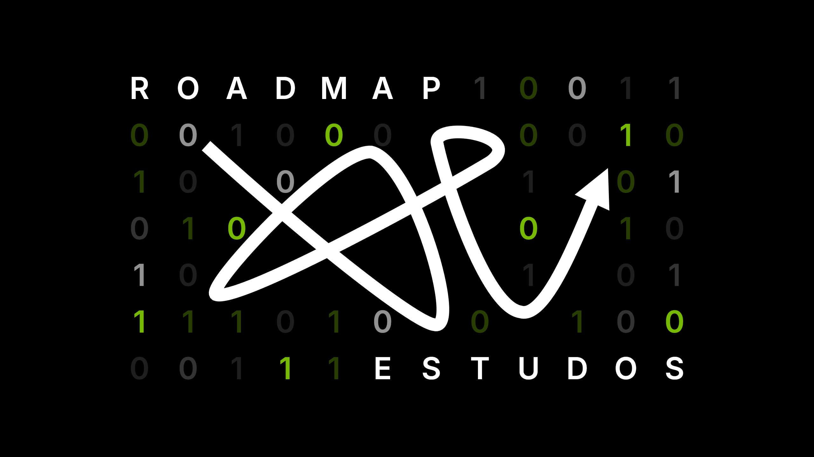
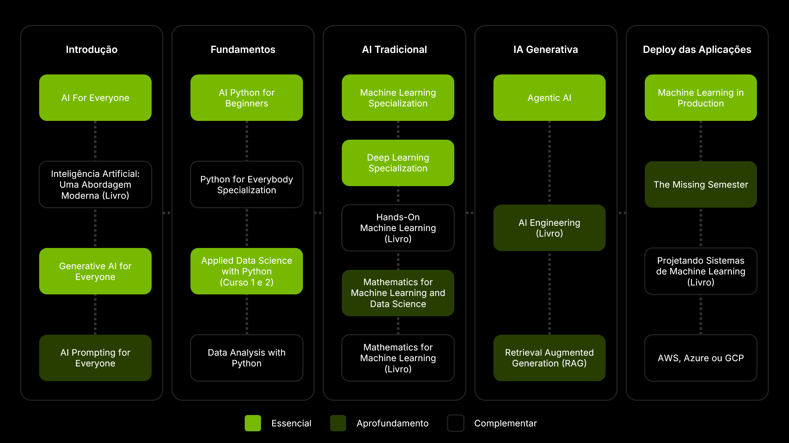

---

title: "Roadmap"
subtitle: "Trilha de estudos de dados e IA"
draft: false
kinds: ["Roadmap"]
categories: ["IA", "Data Science"]
tags: ["Roadmap", "IA", "Data Science"]
slug: "roadmap"
---

Quer entrar no mundo da ciência de dados, machine learning e IA, mas não sabe por onde começar?

Essa é uma trilha de estudos que montei para mim e acredito que pode ser útil pra outras pessoas que estão começando do zero.

Eu selecionei só os melhores conteúdos e mais relevantes, com base na minha experiência estudando e aprendendo data science e IA.

Além disso, eles estão organizados em uma ordem que facilita a sua jornada, equilibrando teoria e prática.

---

## Introdução

### IA Tradicional

Antes de aprender a programar ou treinar modelos, sugiro essa introdução à inteligência artificial. Ela te ajudará a ter um panorama geral sobre o que é IA e quais tipos de problema ela pode resolver.









### IA Generativa

Compreenda os conceitos fundamentais por trás da IA generativa.

O curso de Prompting é opcional agora, mas recomendo fortemente porque vai te ajudar muito no seu processo de aprendizagem.









---

## Fundamentos

### Programação com Python

Python é a linguagem mais usada em ciência de dados e IA atualmente. Ela é simples, poderosa e tem uma comunidade enorme por trás. Se você está começando, aprender Python é o primeiro passo.









### Análise de Dados Exploratória

Aprender a programar é só o começo. 

A próxima etapa é usar Python para lidar com dados reais. Você vai aprender a organizar, limpar, explorar e visualizar dados. Essas habilidades são a base fundamental da ciência de dados.

> Dica: não pule essa etapa. Ela te dará o conhecimento necessário para preparar e estruturar os dados antes de treinar qualquer modelo.









---

## IA Tradicional

### Machine Learning

Depois de entender os dados e aprender a manipulá-los, é hora de criar modelos para aprender com eles.

Machine Learning é o coração da inteligência artificial moderna. É o que permite que sistemas reconheçam padrões, aprendam e façam previsões em novos cenários.








### Deep Learning

O deep learning é uma subárea do machine learning.

É usado em problemas mais complexos, como reconhecimento de imagens, voz, texto e geração de conteúdo. Ele é baseado em redes neurais artificiais (algoritmos inspirados no cérebro humano).











### Matemática e Estatística

A matemática é o que sustenta os modelos e algoritmos de machine learning.

Você não precisa ser especialista, mas entender os fundamentos vai te ajudar a tomar decisões melhores e lidar com problemas mais complexos.











---

## IA Generativa

Com a evolução dos modelos de linguagem, surgiu uma nova forma de desenvolver software. Esta seção foca no desenvolvimento de aplicações práticas usando LLMs para criar Agentes.

Existem muitos conteúdos e cursos em GenAI, mas os abaixo são um excelente começo.









<!-- 





 -->



---

## Deploy das Aplicações

Depois de treinar modelos, o desafio é colocá-los para funcionar no mundo real.

MLOps é a área responsável por levar modelos para produção com confiabilidade, segurança e escala. Ela une machine learning, engenharia de software e operações.

Nessa etapa é interessante aprender sobre serviços na nuvem como AWS, Azure ou GCP para deployar os modelos e aplicações.









<!-- 

 -->



---

## Dicas

Aprender ciência de dados e IA é uma jornada longa. Você não aprenderá tudo em um dia.

Então, não se pressione para aprender tudo de uma vez. Foque em dar o próximo passo.

Durante sua jornada, crie projetos práticos e reais. Você aprenderá melhor e mais rápido.
