## Introdução
Ciência da Computação é o estudo da informação, como ela é representada e processada. O curso tem como objetivo desenvolver _computational thinking_, isto é, a capacidade de resolver problemas de forma estruturada.

## Input → Algoritmo → Output
É possível representar essa ideia através desta imagem:
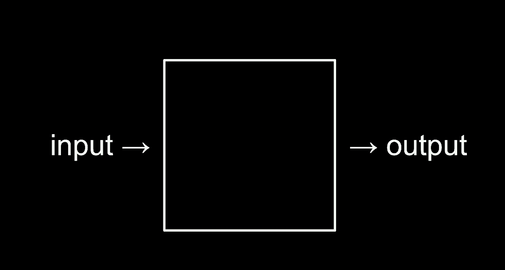

Dado um input, queremos produzir um output. O papel do algoritmo é definir o “meio do caminho”, ou seja, como sair de um para o outro de forma correta e eficiente.

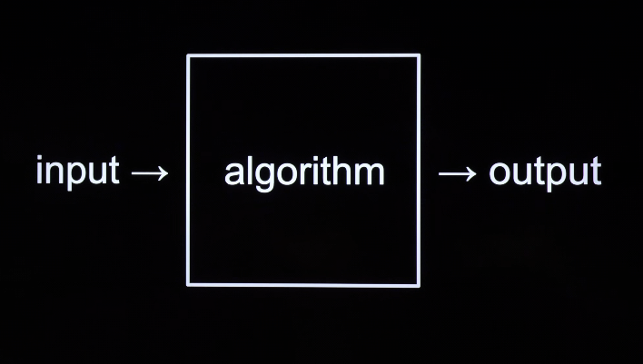

## Como os computadores representam números?

Os computadores ao invés de usar contagem tradicional (base 10), igual usamos (1, 2, 3, 4, 5...), usa binário. Ou seja, cada espaço pode ter dois estados (0 ou 1). Isso é mais eficiente porque é possível representar mais possibilidades com menos espaços.
Exemplo: 
- No sistema base 10 conseguimos representar 6 números em 5 espaços (como nossos dedos da mão) [0, 1, 2, 3, 4, 5]
- No binário (base 2) conseguimos representar 32 em 5 espaços: [0, 0, 0, 0, 0] = 0, [1, 0, 0, 0, 0] = 1, [1, 1, 0, 0, 0] = 2

Bit = _binary digit_ (0 ou 1)  

No sistema de base 10 representamos os números assim:
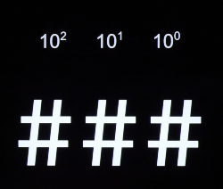

Enquanto que no sistema de base 2, representamos os números assim:
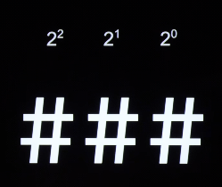

ou

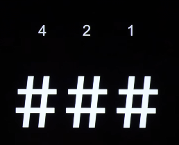

Dessa forma com 3 bits [0, 0, 0] podemos converter para 8 valores decimais:

0 = [0, 0, 0]
1 = [0, 0, 1]
2 = [0. 1, 0] = 4x0 + 2x1 + 1x0
3 = [0, 1, 1] = 4x0 + 2x1 + 1x1
...

7 = [1, 1, 1] = 4x1 + 2x1 + 1x1

Se quisermos contar mais que 7, precisamos ter mais um bit (adicionar mais memória):

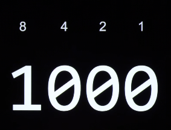

No entanto, usar 3 ou 4 bits não é tão útil, porque limita muito a quantidade de possibilidades. Por isso é usado byte.

Byte = 8 bits (256 possibilidades)

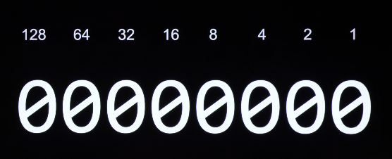

Permite ter 256 possibilidades (do 0 ao 255)

## Como representar as letras e símbolos?

Cada letra é associada a um número.

A = 65
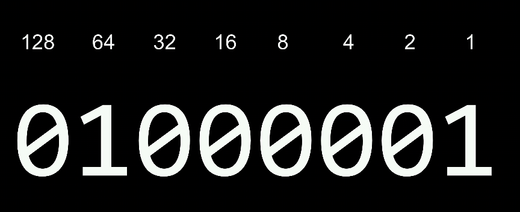

Para isso foi criado o sistema ASCII, um padrão definido que mapeia o que cada valor representa:

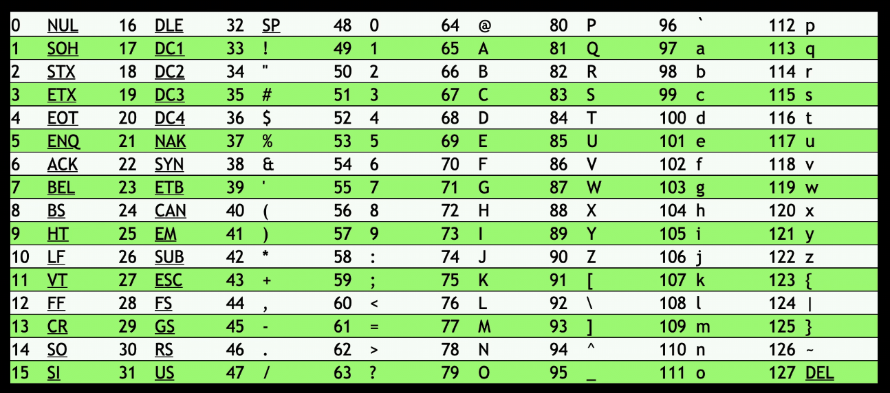

Ou seja, ao receber uma sequência de bytes, são traduzidos para os valores que representam.

Exemplo: ao receber
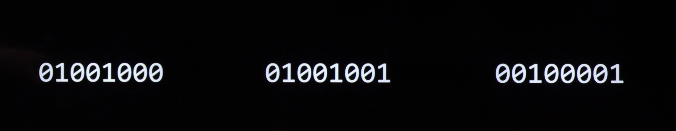

Os valores são traduzidos para `[72, 73, 33] = HI!`

### Unicode e limitações do ASCII

No entanto, precisamos de mais de 256 possibilidades para representar os símbolos que usamos, como letras com acentos, emojis e caráteres de diferentes alfabetos. Por isso, alguns símbolos são representados com 8 bits até 32 bits.

Por isso foi criado um novo sistema, mais amplo, para representar todas essas possibilidades, chamado Unicode, que usa 32 bits (4 bytes).

Exemplo:

Essa sequência de 32 bits: `11110000 10011111 10011000 10000010`, representa o número `4036991106`, que representa 😂

## Como representar cores, imagens e sons?

### Cores
Para representar cores em "zeros e uns" é usado o padrão RGB (red, green, blue). Cada pixel é representado por uma combinação dessas 3 cores, que geram uma cor. Uma imagem com N pixels dependendo da resolução e cada um traz esses 3 valores (RGB) para formar cada pixel.

### Vídeos
Os vídeos são uma sequência de imagens a uma velocidade específica (ex: 30 Frames Per Second). Cada frame contem as informações dos pixels em bits.

### Sons
Os sons são feitos através de uma combinação de _pitch_ (frequência), _volume_ e _duration_, que no computador são representados por amostras numéricas armazenadas em bits.

## Interpretação dos bits

O computador sempre recebe e produz bits (0s e 1s), mas o que esses bits “representam” depende exclusivamente da interpretação feita pelo software, com base em padrões que definem como ler aqueles dados.

## Algoritmos

Entre os inputs e outputs estão os algoritmos. Eles são o que "convertem" os problemas em soluções.

> Um algoritmo são instruções passo a passo para resolver um problema.

Para criar um algoritmo, além do programador precisar se expressar corretamente, é necessário ser extremamente preciso.

### Eficiência de algoritmos

O exemplo dado em aula é da busca de um contato em uma lista telefônica:

Para encontrar o contato na lista é possível passar página a página procurando o nome da pessoa. Esse algoritmo demoraria a quantidade de páginas até o nome (podendo ser demorado).

Uma segunda opção é passar de 2 em 2 páginas, e caso eu passar o nome, eu retorno uma página. Esse algoritmo seria 2x mais rápido que o primeiro + 1 página.

Uma terceira opção (que é usada nos celulares) é ir para o meio da lista e verificar se o valor está antes ou depois do ponto atual, excluindo a outra metade. Isso reduz o problema pela metade em apenas "um passo". Isso é feito recorrentemente até encontrar o item final ou não encontrá-lo (se não estiver na lista).

Em uma lista com 1000 itens, em apenas 10 passos é possível encontrar o valor, independente em qual posição ele está.

Então o desafio não é só escrever código correto, mas sim bem otimizado / desenhado. Para avaliar isso é possível plotar uma visão do tempo para resolver um problema vs o tamanho do problema.

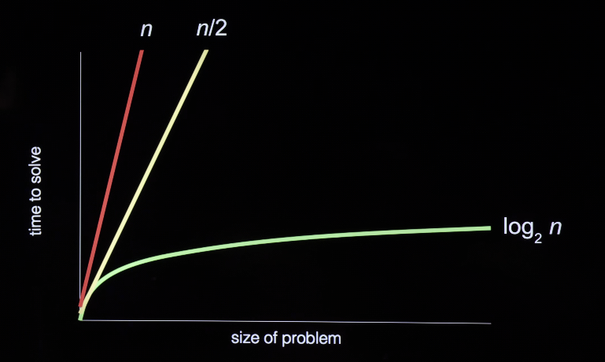

No primeiro algoritmo (linha vermelha) o tempo para resolver um problema é n, ou seja, é a quantidade do tamanho do problema (no caso da lista, as páginas ou número de contatos). Então se aumentar a quantidade de contatos/páginas o tempo de busca aumenta para N+1.

No segunda (linha amarela) o tempo seria metade (n/2) em relação ao primeiro para o mesmo tamanho do problema.

Já o terceiro (linha verde), teria um tempo log2 n, ou seja, mesmo se a lista crescer muito a quantidade de tempo a mais será muito menor, que os anteriores. Exemplo: em um cenário que o problema dobre, seria necessário só um passo a mais (quebrando ele pela metade).

Essa é a importância de entender algoritmos: não apenas para resolver problemas, mas para resolvê-los bem. Isso impacta diretamente a experiência do usuário (usabilidade) e os resultados do negócio (custo).

### Estrutura e características dos algoritmos

Os algoritmos podem ser descritos em código ou em linguagem natural (pseudocode), apenas como exercício mental e pedagógico.

Pseudocode para algoritmo da lista telefônica:
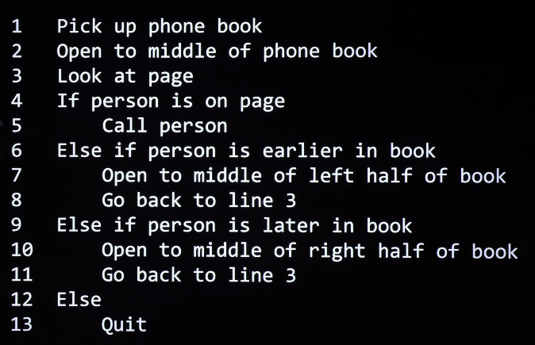

Algumas características comuns a algoritmos bem definidos:

Ações representadas por verbos, que no código serão `funções`.
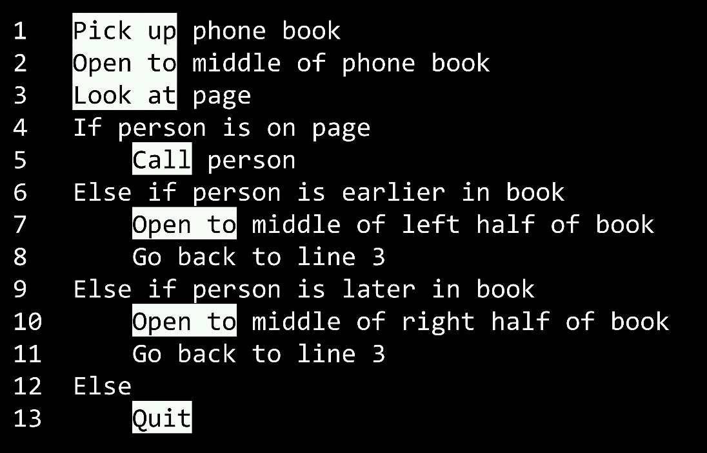

Condições com uma expressão ``Booleana``, ou seja, respostas de ``True`` ou ``False``
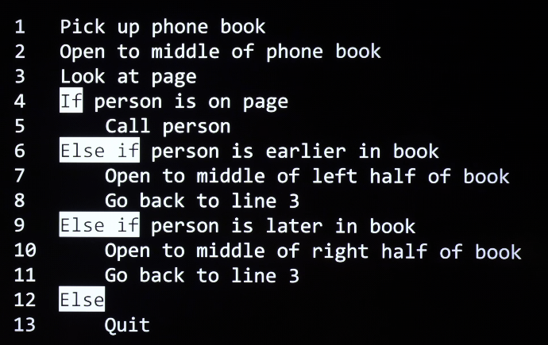

A identação é importante tanto em pseudocode, quanto em muitas linguagens.

Loop, faz com que o código retorne novamente para um trecho até certa condição.
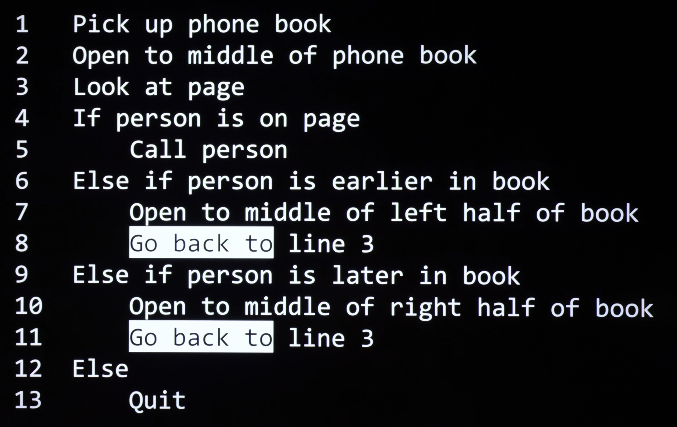

Independentemente da linguagem utilizada, algoritmos compartilham estruturas comuns que permitem expressar lógica, decisões e repetição de forma precisa.

## Abstração e linguagens de programação

Apesar dos computador entenderem apenas binário (0s e 1s), existem diferentes níveis de abstrações das linguagens. Sendo a mais baixa, linguagem de máquina (binária) e mais altas como C, Python, Java e etc.

Neste curso será ensinado C não para ser usado no dia a dia, mas para criar uma base conceitual sólida que permita entender profundamente linguagens mais modernas (como Python, Javascript e SQL), que abstraem muitos detalhes do funcionamento do computador.

Antes disso, a lógica de programação será introduzida de forma simples e acessível, com foco no raciocínio lógico e não nos detalhes técnicos da linguagem, utilizando o Scratch, uma linguagem visual desenvolvida no MIT.

## Projeto da Semana

Como exercício prático desta aula, o objetivo é aplicar os conceitos iniciais de *computational thinking* criando um jogo no Scratch. 

O foco do projeto não é a linguagem em si, mas a capacidade de estruturar lógica, definir regras claras, trabalhar com condições, eventos e loops, e transformar um input em um output desejado.

Abaixo está o jogo desenvolvido como projeto desta semana:

<iframe src="https://scratch.mit.edu/projects/1172239068/embed" allowtransparency="true" width="485" height="402" frameborder="0" scrolling="no" allowfullscreen></iframe>
