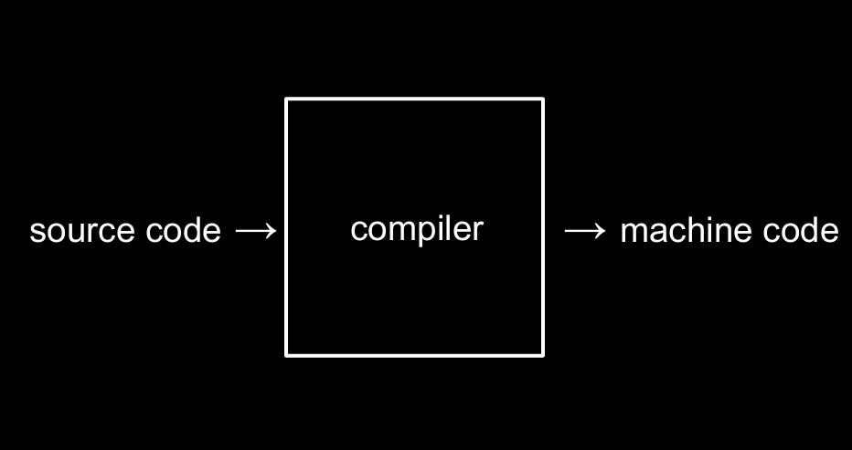
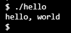
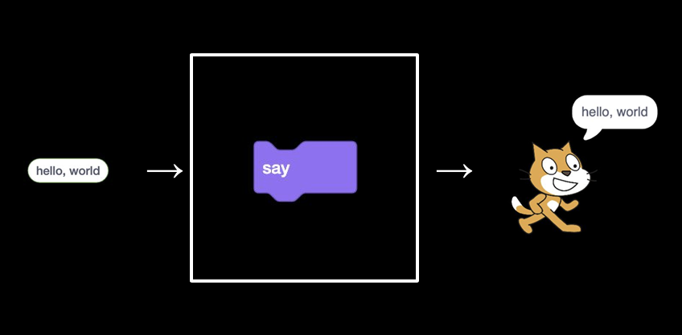
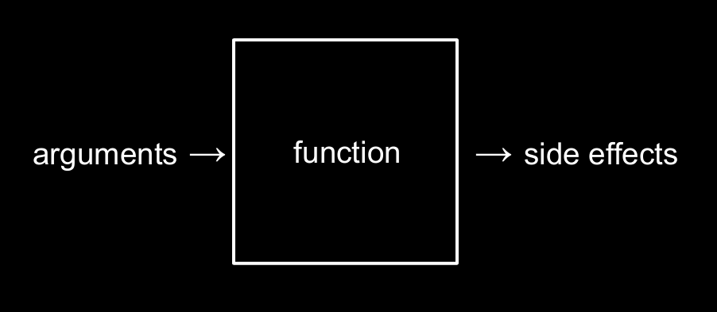
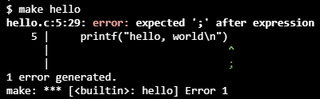

## Introdução

Nesta aula será apresentado a linguagem C.

Ao escrever código produzimos um `source code` que será transformado em `machine code` (binário) para o computador entender e executar. O tipo de programa que traduz linguagem alta nível para linguagem de máquina chama `compiler`.




### Ambiente

Para a aula será usado um ambiente virtual do VS Code, com as dependências já pré-instaladas, acessível em **cs50.dev**.

No VS Code temos dois espaços principais: **(1)** o editor, onde escrevemos o código, e **(2)** o terminal, onde compilamos e executamos os programas.

O editor, com botões, menus e elementos visuais, é um exemplo de ``graphical user interface (GUI)``. Já o terminal, onde interagimos digitando comandos de texto, é chamado de ``command-line interface (CLI)``.


## Hello, World!

No CLI executamos `code hello.c` para criar um arquivo C, onde inserimos o código:

``` c {filename="hello.c"}
#include <stdio.h>

int main(void)
{
    printf("hello, world\n");
}
```

Para compilar o código, transformando em linguagem de máquina executamos `make hello`, que gera o arquivo `hello` e para executá-lo usamos `./hello`, que apresenta o output no terminal:



Assim como tínhamos no Scratch:


Temos os argumentos, função e resultado do nosso código:


### Escape sequences

``Escape sequencies`` são sequencias especiais de símbolos que fazem algo, como:

- ``\n`` move para a próxima linha
- ``\r`` move o cursor para a esquerda
- ``\"``  para usar aspas dentro que texto 

### Erros

Ao tentar compilar o código (transformar em linguagem de máquina), o compilador pode encontrar erros, retornando com uma indicação no terminal:



Neste exemplo, o compilador indica que houve um erro na linha 5, no caractere 29. No qual era esperado ";" e indica visualmente o local.


## Header files

Header files são bibliotecas: arquivos escritos por outras pessoas que disponibilizam funções prontas para serem usadas no seu código, evitando que você tenha que implementar tudo do zero.

No código feito anteriormente `printf` é uma função que é importada pelo header file `stdio.h`.

As bibliotecas do C podem ser encontradas nas documentações oficiais na internet. Porém, muitas delas têm como público-alvo desenvolvedores mais experientes. Por isso, o curso disponibiliza um compilado das bibliotecas mais relevantes em [manual.cs50.io](https://manual.cs50.io).

Além das bibliotecas padrão do C, o curso também disponibiliza uma biblioteca específica chamada [`cs50.h`](https://manual.cs50.io/#cs50.h), que inclui algumas funções utilitárias para facilitar o aprendizado.

Uma dessas funções é `get_string`, que solicita ao usuário a entrada de uma `string`. Queremos capturar o valor de input do usuário e guardar em uma variável. Para isso fazemos:
``
``` c {filename="get_string.c"}
string answer = get_string("Qual seu nome?" );
```

Ao criar uma variável no C para guardar um valor é obrigatório definir qual o tipo da variável que será criada. Neste caso uma `string`, indicada antes do nome da variável.

Para imprimir o valor capturado podemos fazer:

``` c {filename="print_str.c"}
printf("olá, %s\n", answer);
```

`%s` é um _format specifier_ (especificador de formato) para uma `string`, que será substituída pelo valor armazenado na variável `answer`, recebida como entrada do usuário.

Dessa forma, o código inteiro seria:

``` c {filename="print_hello_name.c"}
#include <stdio.h>
#include <cs50.h>

int main(void)
{
    string answer = get_string("Qual seu nome?" );
    printf("Olá, %s\n", answer);
}
```

Esse programa:
- Importa o header file `stdio.h`, que disponibiliza a função `printf`.
- Importa o header file `cs50.h`, que disponibiliza a função `get_string` e o tipo `string`.
- Define a função `main`, que é o ponto de entrada do programa.
- Solicita ao usuário que digite seu nome e armazena o valor na variável `answer`, indicando que é uma ``string``.
- Imprime uma mensagem no terminal usando o valor informado pelo usuário.

## Sistemas operacionais

Os sistemas operacionais são os softwares que fazem as operações fundamentais em um dispositivo. Um sistema operacional muito famoso no mundo da programação (principalmente em servidores) é o ``Linux``.

O Linux é extremamente performático e geralmente é usado como ``command-line interface``. E para isso tem diversos comandos que são usados frequentemente, como:

`ls` (*list*): lista os arquivos e pastas do diretório atual.
``` terminal
$ ls
hello
hello.c
```


`rm` (*remove*): remove arquivos.
``` terminal
$ rm hello
rm: remove regular file 'hello'? y
```


`mkdir` (*make directory*): cria uma nova pasta.
``` terminal
$ mkdir hello
$ ls
hello/
hello.c
```


`mv` (*move*): move ou renomeia arquivos e pastas.
``` terminal
$ mv hello.c hello/
$ ls
hello/
```


`cd` (*change directory*): navega entre pastas.
``` terminal
$ cd hello
hello/ $
```


`rmdir` (*remove directory*): remove pastas vazias.
``` terminal
$ rmdir hello
rmdir: failed to remove 'hello': Directory not empty
```


`make`: compila um programa em C a partir de um arquivo `.c`, gerando um arquivo executável com o mesmo nome.

```terminal
hello/ $ make hello
hello/ $ ls
hello hello.c
```


Outras dicas relevantes: `cd` sem argumentos leva você para o diretório padrão (home), enquanto `cd ..` retorna para o diretório pai.


## Condicionais

Em C, usamos **condicionais** para executar código com base em uma expressão lógica (`true` ou `false`).

A estrutura principal é o `if`, que avalia uma condição:

- Se for **verdadeira**, o bloco é executado.
- Se for **falsa**, o bloco é ignorado.

### Estrutura básica: ``if`` / ``else``

```c
if (x < y)
{
    printf("x é menor que y\n");
}
else
{
    printf("x é maior que y\n");
}
```


### Múltiplas condições: `else if`

Quando há mais de duas possibilidades, usamos `else if`:
```c
if (x < y)
{
    printf("x é menor que y\n");
}
else if (x > y)
{
    printf("x é maior que y\n");
}
```
O programa testa as condições **em ordem**, de cima para baixo.

A primeira que for verdadeira é executada.

### Caso padrão: `else`

O `else` é usado como **caso final**, quando nenhuma condição anterior é satisfeita:

Podemos incluir uma condição com o "resto" com apenas `else`:

```c
if (x < y)
{
    printf("x é menor que y\n");
}
else if (x > y)
{
    printf("x é maior que y\n");
}
else
{
    printf("x é igual a y\n");
}
```


## Operadores

Nas condicionais são usadas expressões lógicas com os operadores:
```c
x == y   // igual a
x != y   // diferente de
x < y    // menor que
x > y    // maior que
x <= y   // menor ou igual a
x >= y   // maior ou igual a
```

Também podemos combinar várias condições usando operadores lógicos:

```c
&&   // AND (e)
||   // OR (ou)
!    // NOT (negação)
```

## Tipos de variáveis

Em C, toda variável precisa ter um **tipo**, que define:

- Quanto espaço ela ocupa na memória
- Que tipo de valor pode armazenar
   
Tipos mais usados:

| Tipo     | Descrição                  | Exemplo         |
| -------- | -------------------------- | --------------- |
| `int`    | Número inteiro             | `10`, `-5`      |
| ``long`` | Número inteiro maiores     | `5789123654`    |
| `float`  | Decimal (precisão simples) | `3.14`          |
| `double` | Decimal (mais preciso)     | `3.141592`      |
| `char`   | Um caractere               | `'A'`, `'a'`    |
| `string` | Texto (CS50)               | `"Hello"`       |
| `bool`   | Verdadeiro/Falso           | `true`, `false` |

### Format Codes

Os **format codes** são usados para indicar ao C qual é o tipo da variável ao imprimir (`printf`).

Principais códigos:

```c
%c   // char (caractere)
%i   // int (inteiro)
%d   // int (inteiro decimal)
%f   // float / double (decimal)
%s   // string (texto)
%lf  // double (no scanf)
```


## Variáveis

Em C define o tipo, nome e valor das variável:

```c
int count = 0;
```

Para incrementar o valor da variável:

```c
count = count + 1;

ou

count =+ 1;

ou

count++;
```

### Escopo de Variáveis (Scope)

Em C, toda variável tem um **escopo**, ou seja, um “lugar” onde ela existe e pode ser usada no código. Fora desse escopo, a variável **não existe**.

Tudo que está entre `{ }` forma um bloco. Como `if`, `else`, `while`, `for`, funções. Uma variável criada dentro de um bloco **só existe dentro dele**.

Exemplo com erro porque `n` só existe dentro do `if`:
```c
if (x > 0)
{
    int n = 10;
    printf("%i\n", n);
}

printf("%i\n", n); // ERRO
```

Exemplo correto, agora `n` existe em toda a função:
```c
int n;

if (x > 0)
{
    n = 10;
}

printf("%i\n", n); // agora funciona
```
## Loops

Em C, **loops** servem para repetir um bloco de código enquanto uma condição for verdadeira.

### While

O `while` repete o código enquanto a condição for verdadeira.

```c
for (inicialização; condição; atualização)
{
    código;
}
```

Exemplo prático:
```c
int i = 3;
while (i > 0)
{
	printf("teste\n")
	i--1  
}
```

### For

O `for` é usado quando já sabemos o início, condição e incremento.

```c
for (inicialização; condição; atualização)
{
    código;
}
```

Exemplo prático:
```c
for (int i = 0; i < 3; i++)
{
	printf("%i\n", i)
}
```

### Do While

O `do while` é um loop parecido com o `while`, com uma diferença importante:

> Ele executa o código **pelo menos uma vez**, mesmo que a condição seja falsa.

```c
do
{
    código;
}
while (condição);
```

Exemplo prático:

```c
int i = 5;

do
{
    printf("%i\n", i);
    i++;
}
while (i < 3);
```

É usado quando:
- Precisa rodar pelo menos uma vez  
- Vai pedir input antes de validar


## Funções

Em C, **funções** servem para organizar o código em partes menores, reutilizáveis e mais fáceis de entender.

Toda função tem:

- Um **tipo de retorno**
- Um **nome**
- Parâmetros (opcional)
- Um bloco `{ }`

```c
tipo nome(parâmetros)
{
    código;
    return valor; // opcional
}
```

### Função simples
```c
#include <stdio.h>

void greet(void)
{
    printf("Olá!\n");
}

int main(void)
{
    greet();
}
```

### Função com parâmetros
```c
#include <stdio.h>

void print_sum(int a, int b)
{
    printf("%i\n", a + b);
}

int main(void)
{
    print_sum(3, 4); // passa valores
}
```

### Função com retorno:
```c
#include <stdio.h>

int sum(int a, int b)
{
    return a + b;
}

int main(void)
{
    int result = sum(5, 2);
    printf("%i\n", result);
}
```

## Protótipo de Função

Se a função for declarada **depois** do `main`, é preciso informar antes. O protótipo “avisa” o compilador que a função existe.

Exemplo:
```c
#include <stdio.h>

int sum(int a, int b); // protótipo

int main(void)
{
    int x = sum(2, 3);
    printf("%i\n", x);
}

int sum(int a, int b)
{
    return a + b;
}
```


## Bom código

Para escrever um bom código, é importante seguir **três características principais**:

1. **Correto (Correctness)**
2. **Bom Design (Design)**
3. **Estilo (Style)**

Um bom software não é apenas aquele que funciona, mas aquele que funciona **do jeito certo**, é bem estruturado e é fácil de manter.

### Correto

Um código é **correto** quando:

- O software se comporta como deveria  
- Segue as regras do problema  
- Atende ao que foi definido nos requisitos

Na prática, isso significa:

> O código implementa corretamente o que foi especificado  
> (por exemplo, por um Product Manager, cliente ou professor).

Exemplo:

Se o requisito é:

> “Somar dois números e mostrar o resultado”

Então este código é correto:
```c
int sum(int a, int b)
{
    return a + b;
}
```

Mas este não é:
```c
int sum(int a, int b)
{
    return a + b + 1; // errado
}
```

Mesmo “funcionando”, o segundo está incorreto.

### Bom Design

Design é como o problema é resolvido, não só corretamente, mas de uma forma otimizada. 

### Estilo

Estilo é sobre como o código é escrito e apresentado. Importando para pessoas e não para o computador.

Um código com bom estilo é:

- Fácil de ler  
- Bem indentado  
- Consistente  
- Com nomes claros

Exemplo ruim
```c
int x=10;int y=20;printf("%i",x+y);
```

Exemplo bom
```c
int x = 10;
int y = 20;

printf("%i\n", x + y);
```

Para o curso CS50 há 3 ferramentas para ajudar a avaliar o código: check50, design50 e style50.


## Problemas Comuns em Programação

Ao trabalhar com números em C, existem alguns problemas clássicos que podem gerar resultados inesperados.

### Integer Overflow

Acontece quando um número inteiro ultrapassa o **limite máximo** do tipo.

Exemplo com `int` (32 bits):

```c
int x = 2147483647; // valor máximo
x = x + 1;

printf("%i\n", x);
```

Saída
```terminal
-2147483648
```
O número “dá a volta”.

Isso acontece porque o espaço na memória é limitado.

Como evitar:
- Usar tipos maiores (`long`, `long long`)  
- Verificar limites antes de somar

### Truncation

Acontece quando a parte decimal é **descartada**, sem arredondar.

Exemplo
```c
int x = 5 / 2;
printf("%i\n", x);
```

Saída
```terminal
2
```
Não é `2.5`. O `.5` é perdido.

Como evitar
- Usar `float` ou `double`  
- Fazer casting, ex: `float x = (float) 5 / 2;`

### Floating-Point Imprecision

Acontece porque números decimais são armazenados em **binário**, e nem todos podem ser representados exatamente.

Exemplo
```c
float x = 0.1 + 0.2;
printf("%f\n", x);
```

Como evitar:
- Comparar com margem de erro (epsilon):
- Usar `double` quando precisar de mais precisão